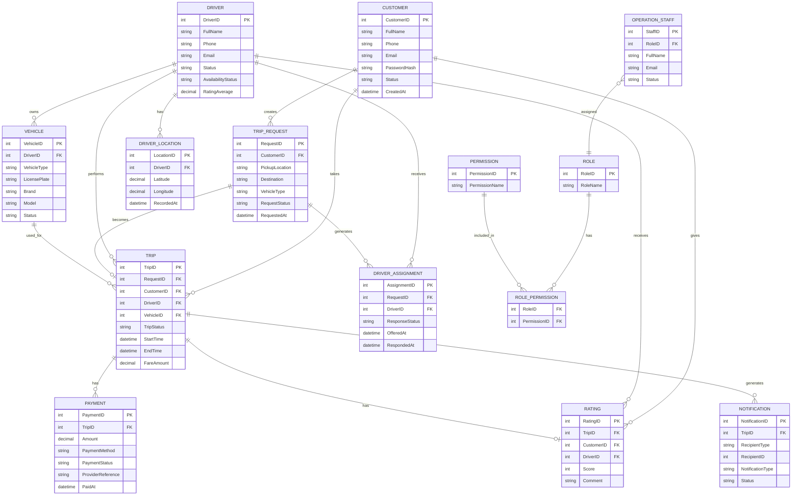
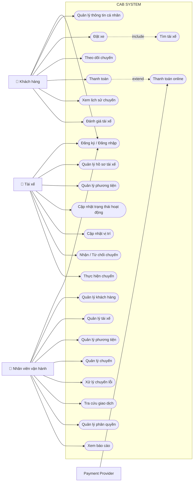

BƯỚC 1: XÁC ĐỊNH BUSINESS CONTEXT – NGỮ CẢNH NGHIỆP VỤ
1. Khách hàng muốn trả lời câu hỏi gì?
Công ty ABC muốn trả lời câu hỏi nghiệp vụ chính: Làm thế nào để xây dựng một nền tảng đặt xe có thể tự động hóa toàn bộ quy trình từ khi khách hàng yêu cầu xe, tìm và phân công tài xế, thực hiện chuyến đi, tính cước, thanh toán, thông báo đến đánh giá sau chuyến; đồng thời hệ thống có thể phục vụ số lượng lớn khách hàng và tài xế và dễ dàng mở rộng trong tương lai?
Làm thế nào để tự động tìm và phân công tài xế phù hợp thay vì thực hiện thủ công?
Làm thế nào để khách hàng theo dõi được trạng thái chuyến đi?
Làm thế nào để quản lý tập trung khách hàng, tài xế, phương tiện và chuyến đi?
Làm thế nào để tính cước và quản lý thanh toán hiệu quả?
Làm thế nào để gửi thông báo kịp thời cho khách hàng và tài xế?
Làm thế nào để nhân viên vận hành theo dõi, quản lý và xử lý sự cố?
Làm thế nào để hệ thống có thể mở rộng khi số lượng người dùng và nhu cầu tăng?
2. Vì sao cần xây dựng CAB System?
Hệ thống hiện tại của Công ty ABC còn nhiều hạn chế: việc phân công tài xế chủ yếu được thực hiện thủ công, khách hàng khó theo dõi trạng thái chuyến đi, thông tin thanh toán chưa được quản lý tập trung và bộ phận vận hành gặp khó khăn khi muốn mở rộng hệ thống.
Vấn đề hiện tại	Ảnh hưởng
Phân công tài xế chủ yếu thủ công	Tốn thời gian, khó xử lý khi số lượng chuyến tăng.
Khách hàng khó theo dõi chuyến	Trải nghiệm khách hàng chưa tốt.
Thanh toán chưa quản lý tập trung	Khó quản lý giao dịch và doanh thu.
Hệ thống khó mở rộng	Khó đáp ứng khi số khách hàng và tài xế tăng.
Khó bổ sung chức năng mới	Tăng chi phí và rủi ro ảnh hưởng các chức năng đang hoạt động.
3. Mục tiêu của hệ thống
Mục tiêu tổng quát là xây dựng một nền tảng CAB hoàn chỉnh, ổn định và có khả năng phát triển lâu dài, hỗ trợ xuyên suốt quy trình: Đặt xe → Tìm tài xế → Phân công → Thực hiện chuyến → Tính cước → Thanh toán → Thông báo → Đánh giá.
Tự động hóa việc tìm và phân công tài xế.
Cho phép khách hàng theo dõi trạng thái chuyến đi.
Quản lý tập trung khách hàng, tài xế, phương tiện và chuyến đi.
Hỗ trợ tính cước và nhiều phương thức thanh toán.
Tự động gửi thông báo về các sự kiện quan trọng.
Hỗ trợ nhân viên vận hành quản lý và giám sát hoạt động.
Cung cấp báo cáo, thống kê phục vụ quản lý.
Đảm bảo xác thực, bảo mật và phân quyền.
Cho phép các thành phần mở rộng độc lập khi tải tăng.
Dễ dàng bổ sung dịch vụ, phương thức thanh toán và kênh thông báo trong tương lai.
4. Ai là người sử dụng hệ thống?
Người sử dụng	Vai trò
Khách hàng (Customer)	Đăng ký, đăng nhập, cập nhật thông tin, đặt xe, chọn loại xe, theo dõi chuyến, xem lịch sử, thanh toán và đánh giá tài xế.
Tài xế (Driver)	Quản lý hồ sơ và phương tiện, cập nhật trạng thái hoạt động, nhận/từ chối chuyến và cập nhật trạng thái chuyến.
Nhân viên vận hành (Operation Staff)	Quản lý khách hàng, tài xế, phương tiện, chuyến đi; theo dõi hoạt động, xử lý sự cố, tra cứu giao dịch và thực hiện chức năng quản trị theo quyền.
Ngoài ba nhóm người dùng chính, CAB System còn tương tác với nhà cung cấp thanh toán bên ngoài để thực hiện thanh toán điện tử.
5. Giá trị của CAB System so với hệ thống cũ
Hệ thống cũ	CAB System mới
Phân công tài xế thủ công	Tự động tìm và phân công tài xế phù hợp.
Khó theo dõi chuyến	Theo dõi trạng thái chuyến đi rõ ràng.
Thanh toán chưa tập trung	Quản lý thanh toán tập trung và hỗ trợ thanh toán điện tử.
Khó biết vị trí tài xế	Lưu vị trí tài xế để tìm tài xế gần khách hàng và dự kiến thời gian đến.
Khó xử lý khi tài xế từ chối	Tự động tiếp tục tìm tài xế khác mà khách hàng không phải tạo lại yêu cầu.
Thông báo hạn chế	Thông báo tự động theo các sự kiện của chuyến đi.
Quản lý vận hành khó khăn	Có giao diện quản trị và phân quyền.
Khó thống kê	Có báo cáo về số chuyến, doanh thu, tỷ lệ hoàn thành, tỷ lệ hủy và hiệu quả tài xế.
Khó mở rộng	Các thành phần có thể mở rộng độc lập.
Khó thêm chức năng	Kiến trúc linh hoạt để thêm dịch vụ, thanh toán và nhà cung cấp thông báo mới.
6. Business Problem
Business Problem chính: Hệ thống đặt xe hiện tại của Công ty ABC còn phụ thuộc nhiều vào xử lý thủ công, đặc biệt trong việc phân công tài xế; khách hàng khó theo dõi trạng thái chuyến đi; thông tin thanh toán chưa được quản lý tập trung; và hệ thống hiện tại khó mở rộng khi số lượng khách hàng, tài xế và nhu cầu sử dụng tăng lên.
Những hạn chế này làm giảm hiệu quả vận hành, ảnh hưởng đến trải nghiệm khách hàng và gây khó khăn cho doanh nghiệp khi muốn mở rộng quy mô.
7. Các Business Problem cụ thể
1. Phân công tài xế còn thủ công: Tốn thời gian, khó tìm tài xế phù hợp/gần khách hàng và khó xử lý khi tài xế không phản hồi hoặc từ chối.
2. Khách hàng khó theo dõi chuyến đi: Khách hàng khó biết hệ thống đang tìm tài xế, tài xế nào nhận chuyến, thời gian dự kiến đến và trạng thái hiện tại.
3. Thanh toán chưa được quản lý tập trung: Doanh nghiệp cần quản lý tiền mặt và thanh toán điện tử, đồng thời xử lý trường hợp giao dịch điện tử thất bại.
4. Hệ thống hiện tại khó mở rộng: Khó đáp ứng tải tăng, khó triển khai chức năng mới từng phần và cần hạn chế lỗi ở một chức năng ảnh hưởng toàn hệ thống.

# BƯỚC 2: XÁC ĐỊNH STAKEHOLDER
| **Stakeholder**                                            | **Vai trò**                                                                                                                                                                  
| **Ban giám đốc / Ban lãnh đạo Công ty ABC**                | Đưa ra định hướng, mục tiêu và yêu cầu tổng thể của dự án; mong muốn hệ thống có khả năng mở rộng lâu dài; theo dõi các báo cáo về số chuyến, doanh thu, tỷ lệ hoàn thành, tỷ lệ hủy và hiệu quả tài xế. |
| **Khách hàng (Customer)**                                  | Người trực tiếp sử dụng hệ thống để đăng ký/đăng nhập, nhập điểm đón – điểm đến, chọn loại xe, đặt xe, theo dõi chuyến đi, xem lịch sử, thanh toán và đánh giá tài xế.                                   |
| **Tài xế (Driver)**                                        | Người cung cấp dịch vụ vận chuyển; quản lý hồ sơ và phương tiện, cập nhật trạng thái sẵn sàng, nhận/từ chối chuyến và cập nhật trạng thái trong quá trình thực hiện chuyến.                              |
| **Nhân viên vận hành (Operation Staff)**                   | Quản lý khách hàng, tài xế, phương tiện và chuyến đi; theo dõi các chuyến đang diễn ra, kiểm tra trạng thái tài xế, hỗ trợ xử lý chuyến gặp lỗi và tra cứu lịch sử giao dịch.                            |
| **Business Analyst (BA)**                                  | Phân tích yêu cầu nghiệp vụ, xác định phạm vi, tác nhân, quy trình nghiệp vụ, yêu cầu chức năng/phi chức năng, business rules, ngoại lệ và làm rõ những yêu cầu chưa được khách hàng xác định.           |
| **Nhà cung cấp thanh toán bên ngoài (Payment Provider)**   | Cung cấp dịch vụ thanh toán điện tử được tích hợp với CAB System; xử lý giao dịch thanh toán mà không yêu cầu CAB lưu trực tiếp thông tin thẻ/tài khoản nhạy cảm.                                        |
| **Nhà cung cấp dịch vụ thông báo (Notification Provider)** | Hỗ trợ gửi thông báo cho khách hàng và tài xế. Hệ thống được yêu cầu có khả năng bổ sung thêm các kênh/nhà cung cấp thông báo trong tương lai.                                                           |
| **Nhóm phát triển (Development Team)**                     | Xây dựng và triển khai CAB System dựa trên các yêu cầu đã được BA làm rõ.                                                                                                                                |
Trong đó, tài liệu xác định rõ **3 nhóm người dùng chính** của hệ thống là **Khách hàng, Tài xế và Nhân viên vận hành**.  Nhân viên vận hành còn chịu trách nhiệm quản lý và giám sát hoạt động, trong khi ban lãnh đạo cần các báo cáo phục vụ quản lý. 

Dựa trên các stakeholder đã xác định từ **CAB System**, có thể xây dựng **Stakeholder Matrix theo 2 tiêu chí:Power (Mức độ ảnh hưởng/quyền lực):
Khả năng tác động đến quyết định, yêu cầu và sự thành công của dự án.
Interest (Mức độ quan tâm):** Mức độ stakeholder quan tâm hoặc bị ảnh hưởng bởi CAB System.

Tài liệu cho thấy ban lãnh đạo đưa ra các kỳ vọng cấp cao; khách hàng, tài xế và nhân viên vận hành là các nhóm sử dụng/nghiệp vụ chính.  
## 1. Ma trận Power – Interest
                     MỨC ĐỘ QUAN TÂM (INTEREST)
                          THẤP                     CAO
                 ┌─────────────────────┬──────────────────────────────┐
                 │                     │                              │
     CAO         │   KEEP SATISFIED    │       MANAGE CLOSELY         │
                 │                     │                              │
                 │ Payment Provider    │ ★ Ban giám đốc / Lãnh đạo   │
                 │                     │ ★ Business Analyst (BA)      │
MỨC ĐỘ           │                     │ ★ Nhân viên vận hành         │
ẢNH HƯỞNG        │                     │                              │
(POWER)          ├─────────────────────┼──────────────────────────────┤
                 │                     │                              │
     THẤP        │      MONITOR        │        KEEP INFORMED         │
                 │                     │                              │
                 │ Notification        │ ★ Khách hàng                 │
                 │ Provider            │ ★ Tài xế                     │
                 │                     │ ★ Development Team           │
                 │                     │                              │
                 └─────────────────────┴──────────────────────────────┘
```

## 2. Bảng đánh giá mức độ ảnh hưởng

| Stakeholder                     |  Power  | Interest | Nhóm Matrix        | Giải thích                                                                     |
| ------------------------------- | :-----: | :------: | ------------------ | ------------------------------------------------------------------------------ |
| **Ban giám đốc / Ban lãnh đạo** | **Cao** |  **Cao** | **Manage Closely** | Quyết định mục tiêu, định hướng và kỳ vọng của hệ thống                        |
| **Business Analyst (BA)**       | **Cao** |  **Cao** | **Manage Closely** | Phân tích, làm rõ yêu cầu và xác định phạm vi hệ thống                         |
| **Nhân viên vận hành**          | **Cao** |  **Cao** | **Manage Closely** | Trực tiếp quản lý khách hàng, tài xế, phương tiện và chuyến đi                 |
| **Khách hàng**                  |   Thấp  |  **Cao** | **Keep Informed**  | Trực tiếp sử dụng dịch vụ đặt xe và chịu ảnh hưởng lớn bởi chất lượng hệ thống |
| **Tài xế**                      |   Thấp  |  **Cao** | **Keep Informed**  | Trực tiếp nhận và thực hiện chuyến thông qua hệ thống                          |
| **Development Team**            |   Thấp  |  **Cao** | **Keep Informed**  | Xây dựng và triển khai hệ thống dựa trên yêu cầu đã được xác định              |
| **Payment Provider**            | **Cao** |   Thấp   | **Keep Satisfied** | Ảnh hưởng đến khả năng xử lý thanh toán điện tử                                |
| **Notification Provider**       |   Thấp  |   Thấp   | **Monitor**        | Cung cấp kênh thông báo và có thể được thay thế/mở rộng trong tương lai        |
## 3. Ý nghĩa 4 vùng của Stakeholder Matrix
**Manage Closely – Quản lý chặt chẽ:** Ban lãnh đạo, BA và nhân viên vận hành cần được tham gia thường xuyên vào quá trình phân tích yêu cầu, xác nhận nghiệp vụ và các quyết định quan trọng.
**Keep Satisfied – Duy trì sự hài lòng:** Payment Provider cần được quản lý tốt về yêu cầu tích hợp, bảo mật và xử lý giao dịch.
**Keep Informed – Cập nhật thông tin:** Khách hàng, tài xế và Development Team cần được cung cấp đầy đủ thông tin liên quan đến yêu cầu, thay đổi và hoạt động của hệ thống.
**Monitor – Theo dõi:** Notification Provider cần được theo dõi nhưng mức độ tham gia vào quyết định nghiệp vụ cốt lõi thấp hơn. CAB System cũng được yêu cầu có khả năng mở rộng thêm các kênh thông báo mà không phải thay đổi toàn bộ hệ thống.

# BƯỚC 3: XÁC ĐỊNH BUSINESS GOAL THEO YÊU CẦU KHÁCH HÀNG

| Mã       | Business Goal                                             | Phân tích mục tiêu                                                                                                                                                                                                              
| **BG01** | **Hỗ trợ thanh toán trực tuyến**                          | Cho phép khách hàng thanh toán điện tử sau khi hoàn thành chuyến đi, bên   cạnh thanh toán tiền mặt. Hệ thống cần tích hợp với nhà cung cấp thanh toán bên ngoài và không lưu trực tiếp thông tin nhạy cảm của thẻ/tài khoản thanh toán. Khi giao dịch thất bại, hệ thống phải thông báo và hỗ trợ xử lý lại theo chính sách doanh nghiệp.  |
| **BG02** | **Giảm thời gian tìm và phân công tài xế**                | Tự động tìm tài xế phù hợp dựa trên vị trí, trạng thái sẵn sàng và các tiêu chí vận hành. Ưu tiên tài xế phù hợp và gần khách hàng. Nếu tài xế đầu tiên từ chối hoặc không phản hồi, hệ thống tiếp tục tìm tài xế khác mà khách hàng không phải tạo lại yêu cầu.                                                                          |
| **BG03** | **Nâng cao khả năng theo dõi chuyến đi của khách hàng**   | Cho phép khách hàng biết trạng thái của yêu cầu đặt xe, tài xế nào đã nhận chuyến, thời gian dự kiến tài xế đến và trạng thái hiện tại của chuyến đi. Điều này giúp tăng tính minh bạch và cải thiện trải nghiệm khách hàng.                                                                                                              |
| **BG04** | **Tự động hóa và chuẩn hóa quy trình chuyến đi**          | Hỗ trợ toàn bộ quy trình từ khi khách hàng tạo yêu cầu, tìm tài xế, thực hiện chuyến, hoàn thành chuyến, tính cước, thanh toán cho đến đánh giá sau chuyến.                                                                                                                                                                               |
| **BG05** | **Quản lý tập trung thông tin vận hành**                  | Quản lý tập trung khách hàng, tài xế, phương tiện, chuyến đi và lịch sử giao dịch, giúp nhân viên vận hành dễ dàng theo dõi và xử lý các trường hợp phát sinh.                                                                                                                                                                            |
| **BG06** | **Cải thiện khả năng quản lý tài xế**                     | Cho phép quản lý hồ sơ tài xế, phương tiện, trạng thái hoạt động và vị trí tài xế. Dữ liệu vị trí giúp hệ thống tìm tài xế gần khách hàng và hỗ trợ dự kiến thời gian đến.                                                                                                                                                                |
| **BG07** | **Cải thiện việc thông báo cho khách hàng và tài xế**     | Tự động gửi thông báo khi yêu cầu đặt xe được tiếp nhận, khi có tài xế nhận chuyến, khi tài xế đến điểm đón, khi chuyến hoàn thành và khi thanh toán có kết quả; đồng thời thông báo cho tài xế về chuyến mới hoặc thay đổi liên quan.                                                                                                    |
| **BG08** | **Nâng cao hiệu quả quản lý và giám sát hoạt động**       | Cung cấp giao diện quản trị để nhân viên vận hành theo dõi chuyến đang diễn ra, kiểm tra trạng thái tài xế, xử lý chuyến lỗi và tra cứu lịch sử giao dịch.                                                                                                                                                                                |
| **BG09** | **Hỗ trợ ra quyết định bằng báo cáo và thống kê**         | Cung cấp báo cáo về số lượng chuyến, doanh thu, tỷ lệ chuyến hoàn thành, tỷ lệ hủy và hiệu quả hoạt động của tài xế để ban lãnh đạo theo dõi tình hình kinh doanh.                                                                                                                                                                        |
| **BG10** | **Tăng khả năng mở rộng của hệ thống**                    | Hệ thống cần phục vụ được số lượng lớn khách hàng và tài xế, đồng thời các thành phần có thể mở rộng độc lập khi tải tăng.                                                                                                                                                                                                                |
| **BG11** | **Tăng độ ổn định và khả năng chịu lỗi**                  | Lỗi ở chức năng thanh toán hoặc thông báo không được làm toàn bộ hệ thống đặt xe ngừng hoạt động, giúp giảm ảnh hưởng của sự cố đến hoạt động kinh doanh.                                                                                                                                                                                 |
| **BG12** | **Đảm bảo an toàn và bảo mật dữ liệu**                    | Xác thực khách hàng và tài xế, phân quyền các chức năng quản trị, bảo vệ thông tin cá nhân, phương tiện, vị trí và giao dịch; đồng thời lưu vết các thao tác quan trọng để phục vụ kiểm tra sự cố.                                                                                                                                        |
| **BG13** | **Tạo nền tảng linh hoạt cho phát triển trong tương lai** | Cho phép bổ sung loại dịch vụ mới, phương thức thanh toán mới, nhà cung cấp thông báo mới hoặc thay đổi một số thành phần kỹ thuật mà không phải xây dựng lại toàn bộ hệ thống.                                                                                                                                                        
# BƯỚC 4: XÁC ĐỊNH PHẠM VI – SCOPE

## 1. Scope là gì?
**Scope (phạm vi)** xác định **hệ thống CAB sẽ làm những gì và không làm những gì trong phiên bản/giai đoạn hiện tại**.

Vì dự án CAB System chỉ có **7 tuần xây dựng và triển khai**, nếu đưa toàn bộ mong muốn hiện tại và tương lai vào cùng một phiên bản thì phạm vi sẽ quá lớn. Tài liệu cũng cho biết doanh nghiệp muốn trong tương lai bổ sung loại dịch vụ, phương thức thanh toán, nhà cung cấp thông báo... 

Vì vậy cần **bóp phạm vi (scope reduction)**, ưu tiên quy trình nghiệp vụ cốt lõi.
## 2. Phạm vi tổng thể ban đầu
Nếu lấy toàn bộ yêu cầu khách hàng, CAB System có phạm vi khá rộng:
**Khách hàng**
`Tài khoản → Đặt xe → Theo dõi → Thanh toán → Lịch sử → Đánh giá`
**Tài xế**
`Tài khoản → Phương tiện → Trạng thái → Vị trí → Nhận chuyến → Thực hiện chuyến`
**Vận hành**
`Quản lý KH → Tài xế → Phương tiện → Chuyến → Giao dịch → Báo cáo → Phân quyền`
**Hệ thống**
`Matching → Location → Fare → Payment → Notification → Security → Audit → Reporting`
Trong khi mục tiêu cốt lõi của khách hàng là có một nền tảng xử lý xuyên suốt từ tạo yêu cầu đến hoàn thành chuyến và thanh toán. 
# 3. Bóp phạm vi CAB System

Để phù hợp với **7 tuần**, có thể chia thành:

| **IN SCOPE – Làm trong giai đoạn này**       | **OUT OF SCOPE – Chưa làm**               |
| -------------------------------------------- | ----------------------------------------- |
| Đăng ký, đăng nhập                           | Đăng nhập bằng Google/Facebook            |
| Quản lý thông tin cơ bản khách hàng          | Các tính năng loyalty/thành viên nâng cao |
| Quản lý tài xế                               | Hệ thống tuyển dụng tài xế                |
| Quản lý thông tin phương tiện                | Quản lý bảo trì/sửa chữa phương tiện      |
| Cập nhật trạng thái tài xế                   | Phân tích hành vi tài xế nâng cao         |
| Nhập điểm đón – điểm đến                     | Đặt nhiều điểm dừng phức tạp              |
| Chọn loại xe                                 | Nhiều loại dịch vụ mở rộng                |
| Tạo yêu cầu đặt xe                           | Đặt xe theo lịch                          |
| **Tự động tìm tài xế**                       | AI dự đoán nhu cầu đặt xe                 |
| Tự tìm tài xế khác khi bị từ chối            | Thuật toán tối ưu toàn thành phố nâng cao |
| Theo dõi trạng thái chuyến                   | Phân tích giao thông nâng cao             |
| Tính cước cơ bản                             | Dynamic/Surge Pricing phức tạp            |
| Thanh toán tiền mặt                          | Ví điện tử riêng của CAB                  |
| **Thanh toán online qua 1 Payment Provider** | Tích hợp nhiều Payment Provider           |
| Thông báo cơ bản                             | Nhiều kênh thông báo nâng cao             |
| Lịch sử chuyến đi                            | Phân tích hành vi khách hàng              |
| Đánh giá tài xế                              | Hệ thống thưởng/phạt tài xế tự động       |
| Quản lý chuyến đi                            | Dashboard BI nâng cao                     |
| Quản lý và phân quyền nhân viên              | Hệ thống HRM                              |
| Báo cáo cơ bản                               | Data Warehouse/Business Intelligence      |
# 4. Ví dụ về cách "bóp phạm vi"
### Ví dụ 1 – Thanh toán
**Yêu cầu khách hàng ban đầu:**
> Hệ thống hỗ trợ tiền mặt hoặc phương thức thanh toán điện tử và doanh nghiệp muốn tích hợp nhà cung cấp thanh toán bên ngoài. 
Nếu làm rộng:
Tiền mặt
+ Thẻ Visa/Mastercard
+ MoMo
+ ZaloPay
+ VNPay
+ PayPal
+ Ví CAB
→ Quá rộng cho giai đoạn đầu.
### Bóp phạm vi:
Giai đoạn 1:
✓ Tiền mặt
✓ 01 nhà cung cấp thanh toán online
✗ Chưa tích hợp nhiều cổng thanh toán
✗ Chưa xây dựng ví CAB
Như vậy vẫn đáp ứng:
**BG01 – Cho phép thanh toán online**
nhưng giảm đáng kể khối lượng phát triển.
# 5. Ví dụ 2 – Tìm tài xế
Khách hàng yêu cầu hệ thống xác định tài xế dựa trên **vị trí, trạng thái sẵn sàng và một số tiêu chí vận hành**, ưu tiên tài xế phù hợp/gần khách hàng. Nếu tài xế không phản hồi hoặc từ chối thì tiếp tục tìm người khác. 
Nếu làm quá rộng:
AI Matching
↓
Phân tích giao thông
↓
Phân tích lịch sử tài xế
↓
Rating
↓
Tỷ lệ nhận chuyến
↓
Dự đoán nhu cầu
↓
Tối ưu khoảng cách
↓
Tự động phân công
→ Phạm vi rất lớn.

### Bóp lại:
Khách đặt xe
      ↓
Tìm tài xế đang AVAILABLE
      ↓
Kiểm tra loại xe phù hợp
      ↓
Tìm tài xế gần khách hàng
      ↓
Gửi yêu cầu
      ↓
Tài xế nhận?
   ↙         ↘
 Có          Không
 ↓              ↓
Ghép chuyến   Tìm tài xế tiếp theo
Như vậy vẫn đạt:
**BG02 – Giảm thời gian tìm tài xế bằng cách tự động hóa việc tìm và phân công tài xế.**
# 6. Ví dụ 3 – Notification
Yêu cầu tổng thể:
> CAB cần gửi thông báo cho khách hàng và tài xế, đồng thời có khả năng mở rộng thêm kênh thông báo trong tương lai. 
Không cần làm ngay:
Push Notification
+ SMS
+ Email
+ Zalo
+ Messenger
+ Telegram
Có thể bóp lại:
Giai đoạn 1
     ↓
Notification Service
     ↓
Push Notification
Thiết kế `Notification Service` đủ độc lập để **sau này** thêm SMS, Email hoặc provider khác mà không phải sửa toàn bộ CAB System.
# 7. Phạm vi đề xuất cuối cùng cho CAB System

### IN SCOPE
> **CAB System giai đoạn hiện tại tập trung vào quy trình nghiệp vụ cốt lõi từ khi khách hàng tạo yêu cầu đặt xe đến khi chuyến đi hoàn thành. Hệ thống hỗ trợ quản lý tài khoản khách hàng và tài xế, quản lý phương tiện, tạo yêu cầu đặt xe, tự động tìm và phân công tài xế phù hợp, theo dõi trạng thái chuyến đi, tính cước, thanh toán bằng tiền mặt hoặc một phương thức thanh toán điện tử, gửi thông báo cơ bản, lưu lịch sử chuyến đi, đánh giá tài xế và cung cấp các chức năng quản lý vận hành cơ bản.**

### OUT OF SCOPE / FUTURE SCOPE

> **Các chức năng mở rộng như nhiều loại dịch vụ mới, nhiều nhà cung cấp thanh toán, nhiều kênh thông báo và các khả năng phân tích/tối ưu nâng cao sẽ chưa triển khai trong giai đoạn đầu. Kiến trúc hệ thống cần được thiết kế để có thể bổ sung các chức năng này trong tương lai mà không phải xây dựng lại toàn bộ CAB System.**

Cách xác định này phù hợp với yêu cầu quan trọng của khách hàng: **không cần làm tất cả ngay**, nhưng hệ thống phải đủ linh hoạt để phát triển thêm về sau. 

### Liên kết với Business Goal
BUSINESS PROBLEM
      ↓
BUSINESS GOAL
      ↓
SCOPE
      ↓
SYSTEM CAPABILITIES
      ↓
SYSTEM COMPONENTS
Ví dụ:
Business Problem:
Phân công tài xế thủ công
        ↓
BG02:
Giảm thời gian tìm tài xế
        ↓
Scope:
Tự động tìm tài xế AVAILABLE + gần khách
        ↓
System Capability:
Driver Matching
        ↓
System Component:
Matching Service
# BƯỚC 5: CHUYỂN ĐỔI THÀNH BUSINESS REQUIREMENTS

Dựa trên **Business Problem → Business Goal → Scope** đã xác định ở các bước trước và bám theo file yêu cầu CAB System, ta chuyển thành các **Business Requirements (BR)**.

> **Business Requirement = Doanh nghiệp cần hệ thống đáp ứng điều gì để đạt được Business Goal.**

Business Requirement nên tập trung vào **nhu cầu nghiệp vụ**, chưa đi quá sâu vào cách lập trình hay công nghệ triển khai.

## 1. Bảng Business Requirements của CAB System

| Mã       | Business Requirement                                                                                                                                                                          | Business Goal liên quan |
| -------- | --------------------------------------------------------------------------------------------------------------------------------------------------------------------------------------------- | ----------------------- |
| **BR01** | Hệ thống phải cho phép khách hàng **đăng ký, đăng nhập và quản lý thông tin cá nhân** để sử dụng dịch vụ đặt xe.                                                                              | BG04, BG05              |
| **BR02** | Hệ thống phải cho phép khách hàng **nhập điểm đón, điểm đến, lựa chọn loại xe và gửi yêu cầu đặt xe**.                                                                                        | BG04                    |
| **BR03** | Hệ thống phải có khả năng **tự động tìm tài xế phù hợp** dựa trên vị trí, trạng thái sẵn sàng và các tiêu chí vận hành.                                                                       | BG02                    |
| **BR04** | Hệ thống phải **ưu tiên tài xế phù hợp và gần khách hàng** nhằm hỗ trợ giảm thời gian tìm tài xế.                                                                                             | BG02                    |
| **BR05** | Khi tài xế được đề xuất **không phản hồi hoặc từ chối**, hệ thống phải tiếp tục tìm tài xế khác mà khách hàng không cần tạo lại yêu cầu.                                                      | BG02                    |
| **BR06** | Hệ thống phải cho phép khách hàng **theo dõi trạng thái chuyến đi**, bao gồm trạng thái tìm tài xế, tài xế nhận chuyến, thời gian dự kiến đến và trạng thái thực hiện chuyến.                 | BG03                    |
| **BR07** | Hệ thống phải cho phép tài xế **quản lý hồ sơ, thông tin phương tiện và trạng thái hoạt động**.                                                                                               | BG05, BG06              |
| **BR08** | Tài xế phải có khả năng **chấp nhận hoặc từ chối chuyến** và cập nhật trạng thái: đến điểm đón, đã đón khách, đang di chuyển và hoàn thành chuyến.                                            | BG04, BG06              |
| **BR09** | Hệ thống phải **lưu thông tin vị trí tài xế** để hỗ trợ tìm tài xế gần khách hàng và dự kiến thời gian tài xế đến.                                                                            | BG02, BG06              |
| **BR10** | Sau khi chuyến hoàn thành, hệ thống phải **xác định số tiền khách hàng phải trả** dựa trên loại dịch vụ và thông tin chuyến đi.                                                               | BG04                    |
| **BR11** | Hệ thống phải hỗ trợ **thanh toán bằng tiền mặt và thanh toán điện tử**.                                                                                                                      | BG01                    |
| **BR12** | Thanh toán điện tử phải được thực hiện thông qua **nhà cung cấp thanh toán bên ngoài**, không lưu trực tiếp thông tin nhạy cảm của thẻ hoặc tài khoản trong CAB System.                       | BG01, BG07              |
| **BR13** | Khi thanh toán điện tử thất bại, hệ thống phải **thông báo cho khách hàng và cho phép xử lý lại theo chính sách doanh nghiệp**.                                                               | BG01                    |
| **BR14** | Hệ thống phải gửi **thông báo về các sự kiện quan trọng của chuyến đi** cho khách hàng và tài xế.                                                                                             | BG07                    |
| **BR15** | Hệ thống phải cho phép khách hàng **xem lịch sử chuyến đi và đánh giá tài xế** sau khi chuyến hoàn thành.                                                                                     | BG03, BG04              |
| **BR16** | Hệ thống phải cung cấp chức năng để nhân viên vận hành **quản lý khách hàng, tài xế, phương tiện và chuyến đi**.                                                                              | BG05, BG08              |
| **BR17** | Nhân viên vận hành phải có khả năng **theo dõi chuyến đang diễn ra, trạng thái tài xế, xử lý chuyến gặp lỗi và tra cứu lịch sử giao dịch**.                                                   | BG08                    |
| **BR18** | Các chức năng quản trị phải được **phân quyền**, hạn chế nhân viên thông thường thực hiện các thao tác nhạy cảm.                                                                              | BG07                    |
| **BR19** | Hệ thống phải cung cấp **báo cáo về số lượng chuyến, doanh thu, tỷ lệ hoàn thành, tỷ lệ hủy và hiệu quả hoạt động tài xế**.                                                                   | BG09                    |
| **BR20** | Hệ thống phải có khả năng **phục vụ số lượng lớn khách hàng và tài xế, đồng thời cho phép các thành phần mở rộng độc lập khi tải tăng**.                                                      | BG10                    |
| **BR21** | Lỗi ở chức năng thanh toán hoặc thông báo **không được làm toàn bộ hệ thống đặt xe ngừng hoạt động**.                                                                                         | BG11                    |
| **BR22** | Hệ thống phải **bảo vệ thông tin cá nhân, phương tiện, vị trí và dữ liệu giao dịch**, đồng thời lưu vết các thao tác quan trọng.                                                              | BG12                    |
| **BR23** | Hệ thống phải có kiến trúc đủ linh hoạt để trong tương lai có thể **bổ sung loại dịch vụ, phương thức thanh toán và nhà cung cấp thông báo mới** mà không phải xây dựng lại toàn bộ hệ thống. | BG13                    |

Các BR về đặt xe, tài xế và matching được chuyển trực tiếp từ yêu cầu nghiệp vụ trong tài liệu.  Các yêu cầu thanh toán được mô tả rõ ở phần tính cước và payment. 

---

## 2. Bóp lại Business Requirements theo Scope 7 tuần

Ở **B4**, chúng ta đã bóp phạm vi để tránh đưa quá nhiều chức năng vào phiên bản đầu. Vì vậy, nếu làm bài theo **scope đã thu hẹp**, tôi đề xuất giữ các Business Requirement cốt lõi sau:
### Nhóm A – Customer & Booking
**BR01:** Cho phép khách hàng đăng ký, đăng nhập và quản lý thông tin cơ bản.
**BR02:** Cho phép khách hàng nhập điểm đón, điểm đến, chọn loại xe và tạo yêu cầu đặt xe.
**BR03:** Cho phép khách hàng theo dõi trạng thái chuyến đi.
**BR04:** Cho phép khách hàng xem lịch sử chuyến và đánh giá tài xế.
### Nhóm B – Driver
**BR05:** Cho phép quản lý thông tin tài xế và phương tiện.
**BR06:** Cho phép tài xế bật/tắt trạng thái sẵn sàng nhận chuyến.
**BR07:** Cho phép tài xế nhận hoặc từ chối chuyến.
**BR08:** Cho phép tài xế cập nhật trạng thái trong quá trình thực hiện chuyến.
### Nhóm C – Driver Matching
**BR09:** Hệ thống phải tự động tìm tài xế đang sẵn sàng và phù hợp với yêu cầu đặt xe.
**BR10:** Hệ thống phải ưu tiên tài xế phù hợp và gần khách hàng.
**BR11:** Nếu tài xế từ chối hoặc không phản hồi, hệ thống phải tự động tiếp tục tìm tài xế khác.
Đây là một trong những yêu cầu nghiệp vụ quan trọng nhất của CAB System. 
### Nhóm D – Fare & Payment
**BR12:** Hệ thống phải tính số tiền phải trả sau khi chuyến hoàn thành.
**BR13:** Cho phép khách hàng thanh toán bằng tiền mặt.
**BR14:** Cho phép khách hàng thanh toán online thông qua **một nhà cung cấp thanh toán bên ngoài** trong phạm vi giai đoạn đầu.
**BR15:** Hệ thống phải xử lý và thông báo khi thanh toán online thất bại.
Các yêu cầu này trực tiếp hỗ trợ **BG01 – Cho phép thanh toán online**. 
### Nhóm E – Notification
**BR16:** Hệ thống phải gửi thông báo cho khách hàng khi có các thay đổi quan trọng của chuyến.
**BR17:** Hệ thống phải thông báo cho tài xế khi có yêu cầu chuyến mới.
Theo yêu cầu gốc, khách hàng cần được thông báo khi yêu cầu được tiếp nhận, tài xế nhận chuyến, tài xế đến, chuyến hoàn thành và có kết quả thanh toán. 
### Nhóm F – Operation
**BR18:** Nhân viên vận hành phải có khả năng quản lý khách hàng, tài xế, phương tiện và chuyến đi.
**BR19:** Nhân viên vận hành phải có khả năng theo dõi các chuyến đang diễn ra và hỗ trợ xử lý chuyến gặp lỗi.
**BR20:** Hệ thống phải phân quyền đối với các chức năng quản trị quan trọng.
**BR21:** Hệ thống phải cung cấp các báo cáo vận hành cơ bản.
Các yêu cầu quản trị và báo cáo được khách hàng nêu trực tiếp trong tài liệu. 
# 3. Liên kết từ Business Goal → Business Requirement

Phần này rất quan trọng vì giúp chứng minh **BR được sinh ra từ mục tiêu nghiệp vụ nào**, chứ không phải tự nghĩ thêm chức năng.

### Ví dụ BG01 – Thanh toán Online

```text
BUSINESS PROBLEM
Thanh toán chưa được quản lý tập trung
            ↓
BUSINESS GOAL – BG01
Hỗ trợ thanh toán trực tuyến
            ↓
BUSINESS REQUIREMENTS
            ↓
BR12 – Tính cước chuyến đi
BR13 – Thanh toán tiền mặt
BR14 – Thanh toán online
BR15 – Xử lý thanh toán thất bại
```

### Ví dụ BG02 – Giảm thời gian tìm tài xế

```text
BUSINESS PROBLEM
Phân công tài xế chủ yếu thủ công
            ↓
BUSINESS GOAL – BG02
Giảm thời gian tìm và phân công tài xế
            ↓
BUSINESS REQUIREMENTS
            ↓
BR06 – Tài xế cập nhật trạng thái sẵn sàng
BR09 – Tự động tìm tài xế
BR10 – Ưu tiên tài xế phù hợp/gần khách
BR11 – Tự tìm tài xế khác khi bị từ chối
```

# 4. Tổng hợp B1 → B5

Đến bước này, bài CAB System của bạn đang đi theo chuỗi:

```text
B1. BUSINESS CONTEXT
        ↓
Xác định vấn đề và bối cảnh doanh nghiệp

B2. STAKEHOLDERS
        ↓
Ai liên quan và mức độ ảnh hưởng?

B3. BUSINESS GOALS
        ↓
Doanh nghiệp muốn đạt được điều gì?

B4. SCOPE
        ↓
Giai đoạn này làm gì / không làm gì?

B5. BUSINESS REQUIREMENTS
        ↓
Hệ thống cần đáp ứng những yêu cầu nghiệp vụ nào?
```

# BƯỚC 6: XÁC ĐỊNH BUSINESS PROCESS – QUY TRÌNH NGHIỆP VỤ

Dựa trên **Customer-Requirement.docx**, Business Process trung tâm của CAB System là quy trình từ lúc **khách hàng tạo yêu cầu đặt xe → tìm tài xế → thực hiện chuyến → tính cước → thanh toán → thông báo → đánh giá**. Đây cũng chính là chuỗi nghiệp vụ mà khách hàng kỳ vọng nền tảng CAB hỗ trợ xuyên suốt. 

## 6.1. Business Process tổng thể

```text
Khách hàng đăng nhập
        ↓
Nhập điểm đón + điểm đến
        ↓
Chọn loại xe
        ↓
Gửi yêu cầu đặt xe
        ↓
Hệ thống tiếp nhận yêu cầu
        ↓
Tìm tài xế phù hợp
        ↓
Ưu tiên tài xế gần + sẵn sàng
        ↓
Gửi yêu cầu cho tài xế
        ↓
   Tài xế chấp nhận?
       /          \
     Không         Có
       ↓            ↓
Tìm tài xế khác   Ghép chuyến
       ↑            ↓
       └──────   Tài xế đến điểm đón
                    ↓
                Đón khách
                    ↓
               Thực hiện chuyến
                    ↓
               Hoàn thành chuyến
                    ↓
                  Tính cước
                    ↓
             Chọn thanh toán
               /          \
          Tiền mặt       Online
              ↓             ↓
         Xác nhận      Payment Provider
              ↓             ↓
              └──────→ Kết quả thanh toán
                           ↓
                     Lưu giao dịch
                           ↓
                     Lưu lịch sử chuyến
                           ↓
                     Khách hàng đánh giá
                           ↓
                         KẾT THÚC
```

Phần tìm tài xế phải xử lý trường hợp tài xế không phản hồi hoặc từ chối bằng cách tiếp tục tìm tài xế khác, không bắt khách hàng tạo lại yêu cầu. 

---

## 6.2. Chia Business Process thành các quy trình con

| Mã       | Business Process             | Actor chính                  | Đầu vào                         | Kết quả                       |
| -------- | ---------------------------- | ---------------------------- | ------------------------------- | ----------------------------- |
| **BP01** | Quản lý tài khoản khách hàng | Khách hàng                   | Thông tin tài khoản             | Tài khoản hợp lệ              |
| **BP02** | Tạo yêu cầu đặt xe           | Khách hàng                   | Điểm đón, điểm đến, loại xe     | Yêu cầu đặt xe                |
| **BP03** | Tìm và phân công tài xế      | Hệ thống, Tài xế             | Yêu cầu đặt xe + vị trí tài xế  | Tài xế được ghép với chuyến   |
| **BP04** | Thực hiện chuyến đi          | Tài xế, Khách hàng           | Chuyến đã được ghép             | Chuyến hoàn thành             |
| **BP05** | Tính cước                    | Hệ thống                     | Loại dịch vụ + thông tin chuyến | Số tiền phải trả              |
| **BP06** | Thanh toán                   | Khách hàng, Payment Provider | Số tiền + phương thức           | Kết quả thanh toán            |
| **BP07** | Thông báo                    | Hệ thống                     | Sự kiện của chuyến              | Thông báo đến KH/Tài xế       |
| **BP08** | Đánh giá sau chuyến          | Khách hàng                   | Chuyến hoàn thành               | Đánh giá tài xế               |
| **BP09** | Quản lý vận hành             | Nhân viên vận hành           | Dữ liệu KH, tài xế, xe, chuyến  | Dữ liệu được quản lý/giám sát |
| **BP10** | Báo cáo và thống kê          | Ban lãnh đạo/Vận hành        | Dữ liệu hoạt động               | Báo cáo quản trị              |

---

# 6.3. BP02 – Quy trình tạo yêu cầu đặt xe

Theo yêu cầu, khách hàng nhập điểm đón, điểm đến, lựa chọn loại xe và gửi yêu cầu đặt xe. 

```text
Bắt đầu
   ↓
Khách hàng đăng nhập
   ↓
Nhập điểm đón
   ↓
Nhập điểm đến
   ↓
Chọn loại xe
   ↓
Gửi yêu cầu đặt xe
   ↓
Hệ thống tiếp nhận
   ↓
Thông báo yêu cầu đã được tiếp nhận
   ↓
Chuyển sang quá trình tìm tài xế
```

**Kết quả:** một yêu cầu chuyến đi được tạo và chuyển sang **BP03 – Tìm và phân công tài xế**.

---

# 6.4. BP03 – Quy trình tìm và phân công tài xế

Đây là **Business Process quan trọng nhất** vì liên quan trực tiếp đến **BG02 – Giảm thời gian tìm tài xế**.

```text
Nhận yêu cầu đặt xe
        ↓
Lấy vị trí khách hàng
        ↓
Tìm tài xế AVAILABLE
        ↓
Lọc tài xế phù hợp
        ↓
Ưu tiên tài xế gần khách
        ↓
Gửi yêu cầu cho tài xế
        ↓
   Tài xế phản hồi?
      /        \
   Không       Có
     ↓          ↓
Hết thời gian?  Chấp nhận?
   /   \         /    \
 Có    Không   Không   Có
 ↓       ↓       ↓      ↓
Tìm     Chờ    Tìm    Ghép
TX khác        TX khác chuyến
   ↑                    ↓
   └──────────────── Thông báo KH
```

Nếu cuối cùng không tìm được tài xế:

```text
Không còn tài xế phù hợp
        ↓
Thông báo khách hàng
"Không tìm được tài xế"
        ↓
Kết thúc yêu cầu
```

Luồng này bám trực tiếp yêu cầu khách hàng về vị trí, trạng thái sẵn sàng, tiêu chí vận hành, tài xế từ chối/không phản hồi và tìm tài xế khác. 

---

# 6.5. BP04 – Quy trình thực hiện chuyến đi

Tài xế cần cập nhật các trạng thái trong quá trình thực hiện chuyến. 

```text
Tài xế nhận chuyến
        ↓
Di chuyển đến điểm đón
        ↓
Đã đến điểm đón
        ↓
Thông báo khách hàng
        ↓
Đón khách
        ↓
Cập nhật "Đã đón khách"
        ↓
Cập nhật "Đang di chuyển"
        ↓
Di chuyển đến điểm đến
        ↓
Cập nhật "Hoàn thành chuyến"
        ↓
Chuyển sang tính cước
```

---

# 6.6. BP05 – Quy trình tính cước

```text
Chuyến hoàn thành
       ↓
Lấy loại dịch vụ
       ↓
Lấy thông tin chuyến đi
       ↓
Áp dụng quy tắc tính cước
       ↓
Xác định số tiền phải trả
       ↓
Hiển thị số tiền cho khách hàng
       ↓
Chuyển sang thanh toán
```

**Điểm cần BA làm rõ:** tài liệu chưa chốt **cách tính cước cụ thể**, nên ở bước này chưa nên tự đặt công thức tính tiền. 

---

# 6.7. BP06 – Quy trình thanh toán

Khách hàng được hỗ trợ **tiền mặt hoặc thanh toán điện tử**. 

```text
Nhận số tiền phải trả
        ↓
Khách chọn phương thức
       / \
      /   \
Tiền mặt  Online
    ↓        ↓
Xác nhận   Gửi yêu cầu
thanh toán Payment Provider
    ↓        ↓
    │     Thành công?
    │       /    \
    │     Có     Không
    │      ↓        ↓
    │   Ghi nhận  Thông báo lỗi
    │      ↓        ↓
    │      │     Xử lý lại theo
    │      │     chính sách
    └──────┴─────────
           ↓
     Lưu kết quả
           ↓
       Hoàn tất
```

Thông tin nhạy cảm của thẻ/tài khoản thanh toán **không được lưu trực tiếp trong CAB System**. 

---

# 6.8. BP07 – Quy trình thông báo

Hệ thống cần phát thông báo khi có các sự kiện quan trọng. 

```text
Sự kiện xảy ra
      ↓
Notification
      ↓
Xác định người nhận
      ↓
Gửi thông báo
```

Các sự kiện chính:

* Yêu cầu đặt xe được tiếp nhận.
* Có tài xế nhận chuyến.
* Tài xế đến điểm đón.
* Chuyến đi hoàn thành.
* Thanh toán có kết quả.
* Tài xế nhận thông báo chuyến mới.
* Tài xế nhận thông báo về thay đổi của chuyến.

---

# 6.9. BP08 – Quy trình sau chuyến

```text
Chuyến hoàn thành
      ↓
Thanh toán hoàn tất
      ↓
Lưu lịch sử chuyến
      ↓
Khách hàng xem thông tin chuyến
      ↓
Đánh giá tài xế
      ↓
Lưu đánh giá
      ↓
Kết thúc
```

Khách hàng được yêu cầu có khả năng xem lịch sử, số tiền phải trả và đánh giá tài xế sau chuyến. 

---

# 6.10. BP09 – Quy trình quản lý vận hành

```text
Nhân viên đăng nhập
       ↓
Xác thực + kiểm tra quyền
       ↓
Giao diện quản trị
       ↓
 ┌────────┬────────┬──────────┬───────────┐
 ↓        ↓        ↓          ↓
Khách    Tài xế  Phương tiện  Chuyến đi
hàng
                         ↓
                 Theo dõi chuyến
                         ↓
                   Phát hiện lỗi
                         ↓
                   Hỗ trợ xử lý
```

Nhân viên còn có thể tra cứu lịch sử giao dịch; các thao tác nhạy cảm phải được phân quyền. 

---

# 6.11. BP10 – Báo cáo và thống kê

```text
Dữ liệu chuyến + giao dịch + tài xế
                 ↓
             Tổng hợp
                 ↓
             Báo cáo
                 ↓
 ┌───────────────┼───────────────┐
 ↓               ↓               ↓
Số chuyến     Doanh thu     Hiệu quả tài xế
 ↓
Tỷ lệ hoàn thành
 ↓
Tỷ lệ hủy
```

Đây là các chỉ số báo cáo mà ban lãnh đạo mong muốn hệ thống cung cấp. 

## 6.12. Liên kết từ B1 → B6

```text
B1. BUSINESS CONTEXT / PROBLEM
           ↓
B2. STAKEHOLDER
           ↓
B3. BUSINESS GOAL
           ↓
B4. SCOPE
           ↓
B5. BUSINESS REQUIREMENT
           ↓
B6. BUSINESS PROCESS
           ↓
SYSTEM CAPABILITIES
           ↓
SYSTEM COMPONENTS / SERVICES
```

Ví dụ quan trọng nhất:

```text
Business Problem
Phân công tài xế thủ công
        ↓
BG02
Giảm thời gian tìm tài xế
        ↓
BR03 – BR05
Tự động tìm + ưu tiên + tìm lại
        ↓
BP03
Driver Matching Process
        ↓
System Capability
Driver Matching
        ↓
System Component
Matching Service
```
mermaid để vẽ sơ đồ business process trong markdown
flowchart TD
    A([Bắt đầu]) --> B[Khách hàng đăng nhập]
    B --> C[Nhập điểm đón và điểm đến]
    C --> D[Chọn loại xe]
    D --> E[Gửi yêu cầu đặt xe]

    E --> F[Hệ thống tiếp nhận yêu cầu]
    F --> G[Tìm tài xế phù hợp]
    G --> H[Lọc tài xế đang sẵn sàng]
    H --> I[Ưu tiên tài xế gần khách hàng]
    I --> J[Gửi yêu cầu chuyến cho tài xế]

    J --> K{Tài xế chấp nhận?}

    K -- Không --> L[Có tài xế phù hợp khác?]
    L -- Có --> G
    L -- Không --> M[Thông báo không tìm được tài xế]
    M --> Z([Kết thúc])

    K -- Có --> N[Ghép tài xế với chuyến]
    N --> O[Thông báo cho khách hàng]
    O --> P[Tài xế di chuyển đến điểm đón]
    P --> Q[Cập nhật: Đã đến điểm đón]
    Q --> R[Đón khách]
    R --> S[Cập nhật: Đã đón khách]
    S --> T[Cập nhật: Đang di chuyển]
    T --> U[Di chuyển đến điểm đến]
    U --> V[Cập nhật: Hoàn thành chuyến]

    V --> W[Tính cước chuyến đi]
    W --> X[Hiển thị số tiền phải trả]
    X --> Y{Phương thức thanh toán}

    Y -- Tiền mặt --> AA[Xác nhận thanh toán tiền mặt]

    Y -- Online --> AB[Gửi yêu cầu đến Payment Provider]
    AB --> AC{Thanh toán thành công?}

    AC -- Không --> AD[Thông báo thanh toán thất bại]
    AD --> AE[Xử lý lại theo chính sách]
    AE --> AB

    AC -- Có --> AF[Ghi nhận thanh toán thành công]

    AA --> AG[Lưu giao dịch]
    AF --> AG

    AG --> AH[Lưu lịch sử chuyến đi]
    AH --> AI[Khách hàng đánh giá tài xế]
    AI --> AJ[Lưu đánh giá]
    AJ --> Z([Kết thúc])

# BƯỚC 7: PHÂN RÃ YÊU CẦU CHỨC NĂNG

Dựa trên **Business Requirements và Business Process** đã xác định, có thể phân rã yêu cầu chức năng của **CAB System** theo dạng:

**Business Requirement → Functional Group → Functional Requirement (FR)**.

## 1. Cây phân rã chức năng tổng thể

```text
CAB SYSTEM
│
├── 1. Quản lý tài khoản & xác thực
│   ├── Đăng ký tài khoản khách hàng
│   ├── Đăng nhập
│   ├── Cập nhật thông tin cá nhân
│   └── Xác thực người dùng
│
├── 2. Quản lý đặt xe
│   ├── Nhập điểm đón
│   ├── Nhập điểm đến
│   ├── Chọn loại xe
│   ├── Tạo yêu cầu đặt xe
│   └── Theo dõi trạng thái yêu cầu
│
├── 3. Quản lý tài xế & phương tiện
│   ├── Đăng ký/tạo tài khoản tài xế
│   ├── Cập nhật hồ sơ tài xế
│   ├── Cập nhật thông tin phương tiện
│   ├── Cập nhật trạng thái hoạt động
│   └── Cập nhật vị trí tài xế
│
├── 4. Tìm và phân công tài xế
│   ├── Tìm tài xế đang sẵn sàng
│   ├── Lọc tài xế phù hợp
│   ├── Xác định tài xế gần khách hàng
│   ├── Gửi yêu cầu chuyến cho tài xế
│   ├── Tài xế chấp nhận/từ chối
│   ├── Xử lý tài xế không phản hồi
│   ├── Tìm tài xế tiếp theo
│   └── Thông báo khi không tìm được tài xế
│
├── 5. Quản lý chuyến đi
│   ├── Ghép tài xế với chuyến
│   ├── Cập nhật "Đã đến điểm đón"
│   ├── Cập nhật "Đã đón khách"
│   ├── Cập nhật "Đang di chuyển"
│   ├── Cập nhật "Hoàn thành chuyến"
│   └── Theo dõi trạng thái chuyến
│
├── 6. Tính cước
│   ├── Lấy thông tin chuyến
│   ├── Xác định loại dịch vụ
│   └── Tính số tiền phải trả
│
├── 7. Thanh toán
│   ├── Thanh toán tiền mặt
│   ├── Thanh toán điện tử
│   ├── Kết nối Payment Provider
│   ├── Nhận kết quả thanh toán
│   └── Xử lý thanh toán thất bại
│
├── 8. Thông báo
│   ├── Thông báo tiếp nhận yêu cầu
│   ├── Thông báo tài xế nhận chuyến
│   ├── Thông báo tài xế đến
│   ├── Thông báo hoàn thành chuyến
│   ├── Thông báo kết quả thanh toán
│   └── Thông báo chuyến mới cho tài xế
│
├── 9. Lịch sử & đánh giá
│   ├── Xem lịch sử chuyến đi
│   ├── Xem số tiền chuyến đi
│   ├── Đánh giá tài xế
│   └── Lưu đánh giá
│
├── 10. Quản lý vận hành
│   ├── Quản lý khách hàng
│   ├── Quản lý tài xế
│   ├── Quản lý phương tiện
│   ├── Quản lý chuyến đi
│   ├── Theo dõi chuyến đang diễn ra
│   ├── Kiểm tra trạng thái tài xế
│   ├── Hỗ trợ xử lý chuyến lỗi
│   └── Tra cứu lịch sử giao dịch
│
├── 11. Phân quyền & Audit
│   ├── Phân quyền nhân viên
│   ├── Kiểm soát thao tác nhạy cảm
│   └── Lưu vết thao tác quan trọng
│
└── 12. Báo cáo
    ├── Báo cáo số lượng chuyến
    ├── Báo cáo doanh thu
    ├── Báo cáo tỷ lệ hoàn thành
    ├── Báo cáo tỷ lệ hủy
    └── Báo cáo hiệu quả tài xế
```

Các nhóm trên bám theo yêu cầu về khách hàng, tài xế, matching, payment, notification và vận hành trong tài liệu. 

---

# 2. Bảng Functional Requirements

## Nhóm 1 – Account & Authentication

| Mã       | Yêu cầu chức năng                                                                     |
| -------- | ------------------------------------------------------------------------------------- |
| **FR01** | Hệ thống cho phép khách hàng đăng ký tài khoản.                                       |
| **FR02** | Hệ thống cho phép người dùng đăng nhập.                                               |
| **FR03** | Hệ thống cho phép khách hàng cập nhật thông tin cá nhân.                              |
| **FR04** | Hệ thống cho phép tài xế đăng ký hoặc nhân viên vận hành tạo tài khoản tài xế.        |
| **FR05** | Hệ thống xác thực khách hàng và tài xế trước khi sử dụng chức năng yêu cầu tài khoản. |

Các chức năng này được nêu trực tiếp trong yêu cầu khách hàng và tài xế. 

## Nhóm 2 – Booking

| Mã       | Yêu cầu chức năng                                 |
| -------- | ------------------------------------------------- |
| **FR06** | Cho phép khách hàng nhập điểm đón.                |
| **FR07** | Cho phép khách hàng nhập điểm đến.                |
| **FR08** | Cho phép khách hàng lựa chọn loại xe.             |
| **FR09** | Cho phép khách hàng gửi yêu cầu đặt xe.           |
| **FR10** | Ghi nhận yêu cầu đặt xe và trạng thái tìm tài xế. |

---

## Nhóm 3 – Driver & Vehicle

| Mã       | Yêu cầu chức năng                                            |
| -------- | ------------------------------------------------------------ |
| **FR11** | Cho phép tài xế cập nhật hồ sơ.                              |
| **FR12** | Cho phép cập nhật thông tin phương tiện.                     |
| **FR13** | Cho phép tài xế chuyển trạng thái sang sẵn sàng nhận chuyến. |
| **FR14** | Ghi nhận/cập nhật vị trí tài xế.                             |
| **FR15** | Cho phép tài xế nhận thông báo chuyến mới.                   |

Việc lưu vị trí tài xế nhằm hỗ trợ tìm tài xế gần khách hàng và cải thiện dự kiến thời gian đến. 

---

# 3. Driver Matching – nhóm quan trọng nhất

| Mã       | Yêu cầu chức năng                                                     |
| -------- | --------------------------------------------------------------------- |
| **FR16** | Tìm danh sách tài xế đang sẵn sàng.                                   |
| **FR17** | Lọc tài xế phù hợp với yêu cầu chuyến.                                |
| **FR18** | Ưu tiên tài xế phù hợp và gần khách hàng.                             |
| **FR19** | Gửi yêu cầu chuyến đến tài xế được chọn.                              |
| **FR20** | Cho phép tài xế chấp nhận chuyến.                                     |
| **FR21** | Cho phép tài xế từ chối chuyến.                                       |
| **FR22** | Xử lý trường hợp tài xế không phản hồi.                               |
| **FR23** | Tự động tìm tài xế tiếp theo nếu tài xế trước từ chối/không phản hồi. |
| **FR24** | Thông báo cho khách hàng nếu không tìm được tài xế.                   |

Đây là phần trực tiếp giải quyết **Business Problem: phân công tài xế thủ công** và **BG02: giảm thời gian tìm tài xế**. Tài liệu yêu cầu khách hàng không phải tạo lại yêu cầu khi tài xế đầu tiên từ chối. 

---

# 4. Trip Management

| Mã       | Yêu cầu chức năng                                            |
| -------- | ------------------------------------------------------------ |
| **FR25** | Ghép tài xế với yêu cầu chuyến.                              |
| **FR26** | Cho phép tài xế cập nhật trạng thái "Đã đến điểm đón".       |
| **FR27** | Cho phép tài xế cập nhật "Đã đón khách".                     |
| **FR28** | Cho phép cập nhật "Đang di chuyển".                          |
| **FR29** | Cho phép cập nhật "Hoàn thành chuyến".                       |
| **FR30** | Cho phép khách hàng theo dõi trạng thái hiện tại của chuyến. |
| **FR31** | Hiển thị tài xế đã nhận chuyến.                              |
| **FR32** | Hiển thị thời gian dự kiến tài xế đến.                       |

---

# 5. Fare & Payment

| Mã       | Yêu cầu chức năng                                                    |
| -------- | -------------------------------------------------------------------- |
| **FR33** | Lấy thông tin chuyến đã hoàn thành.                                  |
| **FR34** | Xác định số tiền phải trả dựa trên loại dịch vụ và thông tin chuyến. |
| **FR35** | Cho phép thanh toán bằng tiền mặt.                                   |
| **FR36** | Cho phép lựa chọn thanh toán điện tử.                                |
| **FR37** | Gửi yêu cầu thanh toán đến Payment Provider.                         |
| **FR38** | Nhận kết quả thanh toán từ Payment Provider.                         |
| **FR39** | Ghi nhận kết quả giao dịch.                                          |
| **FR40** | Thông báo khi thanh toán thất bại.                                   |
| **FR41** | Cho phép xử lý lại thanh toán thất bại theo chính sách doanh nghiệp. |

Tài liệu **chưa xác định công thức tính cước cụ thể**, vì vậy FR34 chỉ nên dừng ở mức “tính theo loại dịch vụ và thông tin chuyến”, không tự thêm công thức.  

---

# 6. Notification

| Mã       | Yêu cầu chức năng                                          |
| -------- | ---------------------------------------------------------- |
| **FR42** | Thông báo khi yêu cầu đặt xe được tiếp nhận.               |
| **FR43** | Thông báo khi có tài xế nhận chuyến.                       |
| **FR44** | Thông báo khi tài xế đến điểm đón.                         |
| **FR45** | Thông báo khi chuyến hoàn thành.                           |
| **FR46** | Thông báo kết quả thanh toán.                              |
| **FR47** | Thông báo chuyến mới cho tài xế.                           |
| **FR48** | Thông báo cho tài xế khi có thay đổi liên quan đến chuyến. |

Đây là các thời điểm thông báo được khách hàng nêu trực tiếp. 

---

# 7. History & Rating

| Mã       | Yêu cầu chức năng                                              |
| -------- | -------------------------------------------------------------- |
| **FR49** | Cho phép khách hàng xem lịch sử chuyến đi.                     |
| **FR50** | Cho phép khách hàng xem số tiền của chuyến.                    |
| **FR51** | Cho phép khách hàng đánh giá tài xế sau khi hoàn thành chuyến. |
| **FR52** | Lưu thông tin đánh giá.                                        |

---

# 8. Operation Management

| Mã       | Yêu cầu chức năng                       |
| -------- | --------------------------------------- |
| **FR53** | Cho phép nhân viên quản lý khách hàng.  |
| **FR54** | Cho phép nhân viên quản lý tài xế.      |
| **FR55** | Cho phép nhân viên quản lý phương tiện. |
| **FR56** | Cho phép nhân viên quản lý chuyến đi.   |
| **FR57** | Cho phép xem các chuyến đang diễn ra.   |
| **FR58** | Cho phép kiểm tra trạng thái tài xế.    |
| **FR59** | Hỗ trợ xử lý trường hợp chuyến gặp lỗi. |
| **FR60** | Cho phép tra cứu lịch sử giao dịch.     |

---

# 9. Authorization & Audit

| Mã       | Yêu cầu chức năng                                           |
| -------- | ----------------------------------------------------------- |
| **FR61** | Kiểm soát quyền truy cập vào chức năng quản trị.            |
| **FR62** | Hạn chế nhân viên thông thường thực hiện thao tác nhạy cảm. |
| **FR63** | Lưu vết các thao tác quan trọng.                            |

Các chức năng quản trị cần được phân quyền và thao tác quan trọng phải được lưu vết.  

---

# 10. Reporting

| Mã       | Yêu cầu chức năng                       |
| -------- | --------------------------------------- |
| **FR64** | Thống kê số lượng chuyến.               |
| **FR65** | Thống kê doanh thu.                     |
| **FR66** | Thống kê tỷ lệ chuyến hoàn thành.       |
| **FR67** | Thống kê tỷ lệ chuyến hủy.              |
| **FR68** | Thống kê hiệu quả hoạt động của tài xế. |

Các loại báo cáo này được ban lãnh đạo yêu cầu trực tiếp. 

## 11. Quan hệ từ Business Requirement → Functional Requirement

Ví dụ với **BG02 – Giảm thời gian tìm tài xế**:
BG02
Giảm thời gian tìm và phân công tài xế
            ↓
Business Requirements
BR03 + BR04 + BR05
            ↓
Functional Requirements
FR16: Tìm tài xế AVAILABLE
FR17: Lọc tài xế phù hợp
FR18: Ưu tiên tài xế gần
FR19: Gửi yêu cầu cho tài xế
FR20: Chấp nhận chuyến
FR21: Từ chối chuyến
FR22: Xử lý không phản hồi
FR23: Tự động tìm tài xế tiếp theo
FR24: Thông báo không tìm được tài xế

Và **BG01 – Thanh toán online**:
BG01
Hỗ trợ thanh toán trực tuyến
            ↓
Business Requirements
BR10 + BR11 + BR12 + BR13
            ↓
Functional Requirements
FR33: Lấy thông tin chuyến
FR34: Tính cước
FR35: Thanh toán tiền mặt
FR36: Chọn thanh toán online
FR37: Gửi yêu cầu Payment Provider
FR38: Nhận kết quả
FR39: Ghi nhận giao dịch
FR40: Thông báo thất bại
FR41: Xử lý lại thanh toán

# BƯỚC 8: XÁC ĐỊNH BUSINESS RULE VÀ NGOẠI LỆ

Dựa trên **Customer-Requirement.docx**, sau khi phân rã Functional Requirements, ta cần xác định **Business Rule (quy tắc nghiệp vụ)** và **Exception (ngoại lệ)**.

> **Business Rule:** Quy định/điều kiện mà nghiệp vụ CAB phải tuân theo.
> **Exception:** Tình huống bất thường hoặc thất bại có thể xảy ra trong quá trình thực hiện nghiệp vụ.

---

## 1. Business Rules của CAB System

| Mã        | Business Rule                                                                                                                             | Liên quan        |
| --------- | ----------------------------------------------------------------------------------------------------------------------------------------- | ---------------- |
| **BRU01** | Khách hàng và tài xế phải được **xác thực** trước khi sử dụng các chức năng yêu cầu tài khoản.                                            | Tài khoản        |
| **BRU02** | Một yêu cầu đặt xe phải có **điểm đón, điểm đến và loại xe** trước khi được gửi.                                                          | Đặt xe           |
| **BRU03** | Chỉ tài xế ở trạng thái **sẵn sàng nhận chuyến** mới được xem xét để phân công chuyến.                                                    | Matching         |
| **BRU04** | Việc tìm tài xế phải dựa trên **vị trí, trạng thái sẵn sàng và các tiêu chí vận hành khác**.                                              | Matching         |
| **BRU05** | Hệ thống phải **ưu tiên tài xế phù hợp và gần khách hàng**.                                                                               | Matching         |
| **BRU06** | Nếu tài xế được đề xuất **từ chối hoặc không phản hồi**, hệ thống phải tiếp tục tìm tài xế khác.                                          | Matching         |
| **BRU07** | Khách hàng **không phải tạo lại yêu cầu đặt xe** khi tài xế đầu tiên từ chối hoặc không phản hồi.                                         | Matching         |
| **BRU08** | Nếu không tìm được tài xế phù hợp, hệ thống phải **thông báo rõ ràng cho khách hàng**.                                                    | Matching         |
| **BRU09** | Tài xế phải cập nhật trạng thái chuyến theo quá trình thực hiện: **đã đến điểm đón → đã đón khách → đang di chuyển → hoàn thành chuyến**. | Trip             |
| **BRU10** | Số tiền phải trả được xác định **sau khi chuyến hoàn thành**, dựa trên loại dịch vụ và thông tin chuyến đi.                               | Fare             |
| **BRU11** | Khách hàng có thể thanh toán bằng **tiền mặt hoặc thanh toán điện tử**.                                                                   | Payment          |
| **BRU12** | Thanh toán điện tử phải được thực hiện thông qua **nhà cung cấp thanh toán bên ngoài**.                                                   | Payment          |
| **BRU13** | CAB System **không được lưu trực tiếp thông tin nhạy cảm của thẻ hoặc tài khoản thanh toán**.                                             | Payment/Security |
| **BRU14** | Nếu thanh toán điện tử thất bại, hệ thống phải thông báo và cho phép **xử lý lại theo chính sách doanh nghiệp**.                          | Payment          |
| **BRU15** | Khách hàng chỉ thực hiện **đánh giá tài xế sau khi chuyến hoàn thành**.                                                                   | Rating           |
| **BRU16** | Các chức năng quản trị nhạy cảm phải được **kiểm soát quyền truy cập**.                                                                   | Authorization    |
| **BRU17** | Nhân viên thông thường không được thực hiện các **thao tác quản trị nhạy cảm** nếu không có quyền.                                        | Authorization    |
| **BRU18** | Các thao tác quan trọng phải được **lưu vết** để phục vụ kiểm tra khi có sự cố.                                                           | Audit            |

Các quy tắc matching như trạng thái sẵn sàng, vị trí, ưu tiên tài xế gần và tự tìm người khác khi từ chối được nêu trực tiếp trong yêu cầu.  Quy tắc thanh toán và bảo vệ thông tin nhạy cảm cũng được khách hàng nêu rõ. 

---

# 2. Business Rules chưa được khách hàng chốt

Phần này **rất quan trọng khi làm BA**. Không được tự đặt quy tắc nếu khách hàng chưa cung cấp.

| Mã        | Business Rule cần làm rõ  | Câu hỏi cần xác nhận                                       |
| --------- | ------------------------- | ---------------------------------------------------------- |
| **TBD01** | Cách tính cước            | Giá mở cửa? Giá/km? Giá theo thời gian? Phụ phí?           |
| **TBD02** | Tiêu chí ưu tiên tài xế   | Chỉ khoảng cách hay thêm rating, tỷ lệ nhận chuyến...?     |
| **TBD03** | Thời gian tài xế phản hồi | Tài xế có bao nhiêu giây/phút để nhận chuyến?              |
| **TBD04** | Chính sách hủy chuyến     | Ai được hủy? Khi nào? Có phí hủy không?                    |
| **TBD05** | Xử lý mất kết nối         | Mất mạng khi đang nhận/thực hiện chuyến thì xử lý thế nào? |
| **TBD06** | Thời gian lưu dữ liệu     | Lịch sử chuyến, vị trí, giao dịch, audit log lưu bao lâu?  |

Đây chính xác là những vấn đề tài liệu yêu cầu BA phải làm rõ với stakeholder trước khi Development Team xây dựng giải pháp. 

---

# 3. Ngoại lệ – Exceptions

## Nhóm 1 – Đặt xe & tìm tài xế

| Mã       | Ngoại lệ                      | Cách xử lý                                                                                                |
| -------- | ----------------------------- | --------------------------------------------------------------------------------------------------------- |
| **EX01** | Không có tài xế phù hợp       | Thông báo cho khách hàng không tìm được tài xế.                                                           |
| **EX02** | Tài xế từ chối chuyến         | Tự động tìm tài xế tiếp theo.                                                                             |
| **EX03** | Tài xế không phản hồi         | Sau thời gian phản hồi quy định, chuyển sang tài xế khác. **Thời gian cụ thể chưa được khách hàng chốt.** |
| **EX04** | Nhiều tài xế lần lượt từ chối | Tiếp tục tìm cho đến khi có tài xế nhận hoặc không còn tài xế phù hợp.                                    |

EX01–EX04 xuất phát trực tiếp từ yêu cầu matching. 
## Nhóm 2 – Chuyến đi

| Mã       | Ngoại lệ                      | Cách xử lý                                                                       |
| -------- | ----------------------------- | -------------------------------------------------------------------------------- |
| **EX05** | Mất kết nối mạng trong chuyến | **Chưa xác định – cần BA xác nhận với khách hàng.**                              |
| **EX06** | Khách hàng hủy chuyến         | **Chưa xác định chính sách hủy – cần xác nhận.**                                 |
| **EX07** | Tài xế hủy chuyến             | **Chưa xác định – cần làm rõ quy trình tìm lại tài xế và chính sách liên quan.** |

Ở đây không nên tự viết rằng hệ thống chắc chắn sẽ ghép tài xế mới hay phạt tài xế, vì tài liệu nói rõ **chính sách hủy và xử lý mất kết nối chưa được chốt**. 

---

# 4. Ngoại lệ thanh toán

| Mã       | Ngoại lệ                    | Cách xử lý                                                               |
| -------- | --------------------------- | ------------------------------------------------------------------------ |
| **EX08** | Thanh toán điện tử thất bại | Thông báo cho khách hàng.                                                |
| **EX09** | Giao dịch cần thực hiện lại | Cho phép xử lý lại theo chính sách doanh nghiệp.                         |
| **EX10** | Payment Provider gặp lỗi    | CAB cần hạn chế lỗi Payment làm toàn bộ hệ thống đặt xe ngừng hoạt động. |

EX08 và EX09 được yêu cầu trực tiếp trong phần Payment.  Đồng thời khách hàng yêu cầu lỗi thanh toán không được làm toàn bộ CAB System ngừng hoạt động. 
# 5. Ngoại lệ Notification
| Mã       | Ngoại lệ                  | Cách xử lý                                                      |
| -------- | ------------------------- | --------------------------------------------------------------- |
| **EX11** | Dịch vụ thông báo gặp lỗi | Không được làm chức năng đặt xe ngừng hoạt động.                |
| **EX12** | Không gửi được thông báo  | Cơ chế retry/fallback cụ thể **chưa được khách hàng xác định**. |

Khách hàng yêu cầu Payment hoặc Notification gặp lỗi không được làm toàn bộ hệ thống đặt xe dừng. 
# 6. Ngoại lệ về quyền truy cập

| Mã       | Ngoại lệ                                                      | Cách xử lý                              |
| -------- | ------------------------------------------------------------- | --------------------------------------- |
| **EX13** | Người dùng chưa xác thực truy cập chức năng yêu cầu tài khoản | Từ chối truy cập/yêu cầu xác thực.      |
| **EX14** | Nhân viên không đủ quyền thực hiện thao tác nhạy cảm          | Không cho phép thực hiện thao tác.      |
| **EX15** | Có thao tác quan trọng hoặc bất thường                        | Ghi nhận audit log để phục vụ kiểm tra. |

Các yêu cầu về xác thực, phân quyền, bảo vệ dữ liệu và audit được nêu trong tài liệu. 
# 7. Liên kết Business Rule với Functional Requirement
Ví dụ phần **Driver Matching**:

```text id="1vbwji"
BG02
Giảm thời gian tìm tài xế
        ↓
BR03 – BR05
Business Requirements
        ↓
FR16 – FR24
Functional Requirements
        ↓
BUSINESS RULES
BRU03: Tài xế phải AVAILABLE
BRU04: Dựa trên vị trí + trạng thái + tiêu chí
BRU05: Ưu tiên tài xế gần/phù hợp
BRU06: Từ chối → tìm người khác
BRU07: Khách không cần đặt lại
        ↓
EXCEPTIONS
EX01: Không tìm được tài xế
EX02: Tài xế từ chối
EX03: Tài xế không phản hồi
```

Phần **Payment**:
BG01
Thanh toán online
        ↓
BR10 – BR13
Business Requirements
        ↓
FR33 – FR41
Functional Requirements
        ↓
BUSINESS RULES
BRU10: Tính tiền sau khi hoàn thành
BRU11: Tiền mặt / Online
BRU12: Online qua Payment Provider
BRU13: Không lưu dữ liệu thanh toán nhạy cảm
        ↓
EXCEPTIONS
EX08: Thanh toán thất bại
EX09: Xử lý lại giao dịch
EX10: Payment Provider gặp lỗi

# BƯỚC 9: MÔ HÌNH HÓA DỮ LIỆU – DATA MODELING

Dựa trên yêu cầu CAB System, mô hình dữ liệu nên tập trung vào các thực thể nghiệp vụ chính: **Khách hàng, Tài xế, Phương tiện, Chuyến đi, Thanh toán, Đánh giá, Vị trí, Thông báo và Nhân viên vận hành**. Những thực thể này được suy ra trực tiếp từ các nhóm dữ liệu mà hệ thống cần quản lý trong tài liệu.  

## 1. Các thực thể chính

| Thực thể              | Ý nghĩa                                         |
| --------------------- | ----------------------------------------------- |
| **Customer**          | Lưu thông tin khách hàng                        |
| **Driver**            | Lưu thông tin tài xế                            |
| **Vehicle**           | Lưu thông tin phương tiện của tài xế            |
| **Trip**              | Lưu thông tin chuyến đi                         |
| **TripRequest**       | Lưu yêu cầu đặt xe ban đầu                      |
| **DriverAssignment**  | Lưu quá trình hệ thống đề xuất/phân công tài xế |
| **DriverLocation**    | Lưu vị trí tài xế                               |
| **Payment**           | Lưu thông tin thanh toán                        |
| **Rating**            | Lưu đánh giá tài xế sau chuyến                  |
| **Notification**      | Lưu thông báo gửi cho người dùng                |
| **OperationStaff**    | Lưu thông tin nhân viên vận hành                |
| **Role / Permission** | Phục vụ phân quyền                              |
| **AuditLog**          | Lưu vết các thao tác quan trọng                 |

---

# 2. Phân tích dữ liệu từng thực thể

## Customer

| Thuộc tính   | Ý nghĩa              |
| ------------ | -------------------- |
| CustomerID   | Mã khách hàng        |
| FullName     | Họ tên               |
| Phone        | Số điện thoại        |
| Email        | Email                |
| PasswordHash | Thông tin xác thực   |
| Status       | Trạng thái tài khoản |
| CreatedAt    | Ngày tạo             |

Khách hàng cần đăng ký, đăng nhập và cập nhật thông tin cá nhân. 

---

## Driver

| Thuộc tính         | Ý nghĩa                   |
| ------------------ | ------------------------- |
| DriverID           | Mã tài xế                 |
| FullName           | Họ tên                    |
| Phone              | Số điện thoại             |
| Email              | Email                     |
| Status             | Trạng thái tài khoản      |
| AvailabilityStatus | Sẵn sàng / không sẵn sàng |
| RatingAverage      | Điểm đánh giá trung bình  |
| CreatedAt          | Ngày tạo                  |

Tài xế cần có hồ sơ và trạng thái hoạt động để hỗ trợ việc tìm tài xế. 

---

## Vehicle

| Thuộc tính   | Ý nghĩa               |
| ------------ | --------------------- |
| VehicleID    | Mã phương tiện        |
| DriverID     | Tài xế sở hữu/sử dụng |
| VehicleType  | Loại xe               |
| LicensePlate | Biển số               |
| Brand        | Hãng xe               |
| Model        | Mẫu xe                |
| Status       | Trạng thái            |

Quan hệ chính:

```text
Driver 1 ----- N Vehicle
```

Một tài xế có thể có một hoặc nhiều thông tin phương tiện theo thiết kế dữ liệu, nhưng số lượng thực tế cần BA xác nhận nếu nghiệp vụ yêu cầu giới hạn.

---

# 3. TripRequest – Yêu cầu đặt xe

Tách `TripRequest` khỏi `Trip` giúp mô hình đúng hơn vì có trường hợp **khách tạo yêu cầu nhưng không tìm được tài xế**, khi đó chưa chắc đã hình thành chuyến thực tế.

| Thuộc tính     | Ý nghĩa            |
| -------------- | ------------------ |
| RequestID      | Mã yêu cầu         |
| CustomerID     | Khách hàng yêu cầu |
| PickupLocation | Điểm đón           |
| Destination    | Điểm đến           |
| VehicleType    | Loại xe yêu cầu    |
| RequestStatus  | Trạng thái yêu cầu |
| RequestedAt    | Thời gian yêu cầu  |

Trạng thái có thể mô hình hóa ở mức khái niệm như:

```text
Searching
Matched
NoDriverFound
Cancelled
Tuy nhiên chính sách hủy vẫn chưa được khách hàng chốt nên chi tiết `Cancelled` cần xác nhận thêm. 
# 4. DriverAssignment – Phân công tài xế

Đây là thực thể rất quan trọng cho CAB System vì một yêu cầu có thể được gửi lần lượt cho nhiều tài xế.

| Thuộc tính     | Ý nghĩa                           |
| -------------- | --------------------------------- |
| AssignmentID   | Mã phân công                      |
| RequestID      | Yêu cầu đặt xe                    |
| DriverID       | Tài xế được đề xuất               |
| OfferedAt      | Thời điểm gửi yêu cầu             |
| ResponseStatus | Accepted / Rejected / No Response |
| RespondedAt    | Thời điểm phản hồi                |

Quan hệ:

```text
TripRequest 1 ------ N DriverAssignment
Driver      1 ------ N DriverAssignment
```

Ví dụ:

```text
Request R001
   │
   ├── Driver D01 → Rejected
   ├── Driver D02 → No Response
   └── Driver D03 → Accepted
```

Cách mô hình này phản ánh đúng yêu cầu: nếu tài xế đầu tiên không nhận, hệ thống tiếp tục tìm tài xế khác mà khách hàng không phải tạo lại yêu cầu. 

---

# 5. Trip – Chuyến đi

| Thuộc tính           | Ý nghĩa            |
| -------------------- | ------------------ |
| TripID               | Mã chuyến          |
| RequestID            | Yêu cầu đặt xe     |
| CustomerID           | Khách hàng         |
| DriverID             | Tài xế             |
| VehicleID            | Phương tiện        |
| PickupLocation       | Điểm đón           |
| Destination          | Điểm đến           |
| TripStatus           | Trạng thái chuyến  |
| StartTime            | Thời gian bắt đầu  |
| EndTime              | Thời gian kết thúc |
| EstimatedArrivalTime | ETA                |
| FareAmount           | Số tiền chuyến     |

Trạng thái chuyến dựa trên yêu cầu:

```text
DriverAssigned
      ↓
DriverArrived
      ↓
PassengerPickedUp
      ↓
InProgress
      ↓
Completed
```
Đây là các trạng thái tài xế cần cập nhật trong quá trình thực hiện chuyến. 
---

# 6. DriverLocation – Vị trí tài xế

| Thuộc tính | Ý nghĩa            |
| ---------- | ------------------ |
| LocationID | Mã bản ghi         |
| DriverID   | Tài xế             |
| Latitude   | Vĩ độ              |
| Longitude  | Kinh độ            |
| RecordedAt | Thời gian ghi nhận |

Quan hệ:

```text
Driver 1 ----- N DriverLocation
```

CAB cần lưu vị trí tài xế để hỗ trợ tìm tài xế gần khách và cải thiện dự kiến thời gian đến. 

---

# 7. Payment

| Thuộc tính        | Ý nghĩa                    |
| ----------------- | -------------------------- |
| PaymentID         | Mã thanh toán              |
| TripID            | Chuyến đi                  |
| Amount            | Số tiền                    |
| PaymentMethod     | Cash / Online              |
| PaymentStatus     | Pending / Success / Failed |
| ProviderReference | Mã giao dịch của provider  |
| PaidAt            | Thời gian thanh toán       |

Quan hệ:

```text
Trip 1 ----- 0..N Payment
```

Tôi đề xuất `0..N` thay vì cứng `1:1` vì tài liệu cho phép thanh toán điện tử thất bại và xử lý lại, nên về mặt dữ liệu có thể có nhiều lần thử thanh toán cho cùng một chuyến. Đây là một suy luận mô hình hóa từ yêu cầu retry, không phải cardinality được tài liệu ghi trực tiếp. 

Thông tin thẻ/tài khoản nhạy cảm **không nên nằm trong Payment** vì CAB không được lưu trực tiếp các dữ liệu đó. 

---

# 8. Rating

| Thuộc tính | Ý nghĩa           |
| ---------- | ----------------- |
| RatingID   | Mã đánh giá       |
| TripID     | Chuyến            |
| CustomerID | Khách hàng        |
| DriverID   | Tài xế            |
| Score      | Điểm đánh giá     |
| Comment    | Nội dung đánh giá |
| CreatedAt  | Thời gian         |

Quan hệ:

```text
Trip     1 ----- 0..1 Rating
Customer 1 ----- N Rating
Driver   1 ----- N Rating
```

Khách hàng đánh giá tài xế sau khi chuyến hoàn thành. 

---

# 9. Notification

| Thuộc tính       | Ý nghĩa           |
| ---------------- | ----------------- |
| NotificationID   | Mã thông báo      |
| RecipientID      | Người nhận        |
| RecipientType    | Customer / Driver |
| TripID           | Chuyến liên quan  |
| NotificationType | Loại thông báo    |
| Content          | Nội dung          |
| Status           | Sent / Failed     |
| CreatedAt        | Thời gian         |

Ví dụ loại thông báo:

```text
BookingReceived
DriverAssigned
DriverArrived
TripCompleted
PaymentResult
NewTripRequest
```

Các sự kiện này bám theo yêu cầu notification trong tài liệu. 

---

# 10. OperationStaff, Role và Permission

```text
OperationStaff
      │
      N
      │
      1
     Role
      │
      N
      │
      N
 Permission
```

Có thể triển khai bằng bảng trung gian:

```text
RolePermission
```

Các thực thể đề xuất:

### OperationStaff

```text
StaffID
FullName
Email
PasswordHash
RoleID
Status
```

### Role

```text
RoleID
RoleName
```

### Permission

```text
PermissionID
PermissionName
```

### RolePermission

```text
RoleID
PermissionID
```

Điều này hỗ trợ yêu cầu một số chức năng quản trị phải được phân quyền và nhân viên thông thường không được thao tác nhạy cảm. 

---

# 11. AuditLog

| Thuộc tính | Ý nghĩa                   |
| ---------- | ------------------------- |
| AuditID    | Mã log                    |
| UserID     | Người thực hiện           |
| UserType   | Driver / Customer / Staff |
| Action     | Thao tác                  |
| EntityType | Đối tượng bị tác động     |
| EntityID   | ID đối tượng              |
| Timestamp  | Thời gian                 |
| Details    | Chi tiết                  |

CAB cần lưu vết các thao tác quan trọng để phục vụ kiểm tra khi có sự cố. 

# 12. ERD tổng thể bằng Mermaid

Bạn có thể copy đoạn này vào Markdown hỗ trợ Mermaid:



## 13. Những dữ liệu chưa nên chốt cứng

Theo tài liệu, một số thông tin vẫn cần BA làm rõ trước khi thiết kế database chi tiết:

* **Công thức tính cước** → chưa xác định đầy đủ dữ liệu đầu vào cần lưu.
* **Tiêu chí ưu tiên tài xế** → chưa rõ có cần rating, tỷ lệ nhận chuyến, loại tài xế...
* **Thời gian phản hồi tài xế** → chưa chốt timeout.
* **Chính sách hủy chuyến** → chưa rõ cần lưu phí hủy/lý do hủy đến mức nào.
* **Xử lý mất kết nối** → chưa chốt cơ chế đồng bộ dữ liệu.
* **Thời gian lưu dữ liệu** → chưa xác định retention cho location, trip, payment và audit. 

Vì vậy mô hình trên nên xem là **Conceptual/Logical Data Model ban đầu**, chưa phải database schema cuối cùng.

Chuỗi phân tích của bài hiện tại sẽ là:

```text
Business Context
        ↓
Stakeholders
        ↓
Business Goals
        ↓
Scope
        ↓
Business Requirements
        ↓
Business Process
        ↓
Functional Requirements
        ↓
Business Rules + Exceptions
        ↓
DATA MODEL
        ↓
System Capabilities
        ↓
Services / Components
```
# BƯỚC 10: XÁC ĐỊNH YÊU CẦU NON-FUNCTIONAL

**Non-Functional Requirement (NFR)** là các yêu cầu mô tả **hệ thống phải hoạt động như thế nào**, thay vì mô tả hệ thống thực hiện chức năng gì.

Với CAB System, tài liệu khách hàng nêu khá rõ các nhóm yêu cầu về **hiệu năng, khả năng mở rộng, tính sẵn sàng, khả năng chịu lỗi, bảo mật, khả năng bảo trì/mở rộng và audit**. 

## 1. Bảng Non-Functional Requirements

| Mã        | Nhóm NFR         | Yêu cầu Non-Functional                                                                                                     |
| --------- | ---------------- | -------------------------------------------------------------------------------------------------------------------------- |
| **NFR01** | Performance      | Hệ thống phải hoạt động ổn định trong các thời điểm có nhu cầu đặt xe tăng cao.                                            |
| **NFR02** | Scalability      | Hệ thống phải có khả năng phục vụ số lượng lớn khách hàng và tài xế.                                                       |
| **NFR03** | Scalability      | Các thành phần của hệ thống phải có khả năng **mở rộng độc lập** khi tải tăng.                                             |
| **NFR04** | Availability     | Hệ thống đặt xe phải duy trì hoạt động ngay cả khi một số chức năng phụ gặp sự cố.                                         |
| **NFR05** | Fault Tolerance  | Lỗi ở chức năng **thanh toán** không được làm toàn bộ hệ thống đặt xe ngừng hoạt động.                                     |
| **NFR06** | Fault Tolerance  | Lỗi ở chức năng **thông báo** không được làm toàn bộ hệ thống đặt xe ngừng hoạt động.                                      |
| **NFR07** | Maintainability  | Các chức năng mới phải có khả năng được triển khai từng phần và hạn chế ảnh hưởng đến các chức năng đang hoạt động.        |
| **NFR08** | Extensibility    | Hệ thống phải dễ dàng bổ sung các loại dịch vụ mới trong tương lai.                                                        |
| **NFR09** | Extensibility    | Hệ thống phải hỗ trợ bổ sung phương thức thanh toán hoặc Payment Provider mới mà không phải xây dựng lại toàn bộ hệ thống. |
| **NFR10** | Extensibility    | Hệ thống phải hỗ trợ thêm nhà cung cấp hoặc kênh thông báo mới mà không phải thay đổi toàn bộ hệ thống.                    |
| **NFR11** | Security         | Khách hàng và tài xế phải được xác thực trước khi truy cập các chức năng yêu cầu tài khoản.                                |
| **NFR12** | Authorization    | Các chức năng quản trị phải được kiểm soát quyền truy cập.                                                                 |
| **NFR13** | Data Security    | Thông tin cá nhân của người dùng phải được bảo vệ.                                                                         |
| **NFR14** | Data Security    | Thông tin phương tiện và dữ liệu vị trí tài xế phải được bảo vệ.                                                           |
| **NFR15** | Data Security    | Dữ liệu giao dịch phải được bảo vệ.                                                                                        |
| **NFR16** | Payment Security | CAB System không được lưu trực tiếp thông tin nhạy cảm của thẻ hoặc tài khoản thanh toán.                                  |
| **NFR17** | Auditability     | Hệ thống phải lưu vết các thao tác quan trọng để phục vụ kiểm tra khi có sự cố.                                            |
| **NFR18** | Modularity       | Kiến trúc phải đủ linh hoạt để có thể thay đổi một số thành phần kỹ thuật mà không phải xây dựng lại toàn bộ ứng dụng.     |

Các NFR01–NFR10 xuất phát chủ yếu từ yêu cầu hệ thống hoạt động ổn định khi tải cao, các thành phần mở rộng độc lập, cô lập lỗi và triển khai chức năng mới từng phần.  Các NFR về xác thực, phân quyền, bảo vệ dữ liệu và lưu vết được nêu ở phần bảo mật. 

---

## 2. Phân nhóm Non-Functional Requirements

### A. Performance – Hiệu năng

**NFR01:** Hệ thống phải hoạt động ổn định tại các thời điểm nhu cầu đặt xe tăng cao.

Ý nghĩa:

```text
Nhiều khách hàng đặt xe cùng lúc
              ↓
CAB System vẫn phải hoạt động ổn định
              ↓
Không để toàn hệ thống bị quá tải
```

Tài liệu **chưa cung cấp con số cụ thể** như thời gian phản hồi dưới 2 giây hay bao nhiêu request/giây, nên không nên tự thêm KPI này vào yêu cầu chính thức. 

---

## 3. Scalability – Khả năng mở rộng

**NFR02:** CAB System phải hỗ trợ số lượng lớn khách hàng và tài xế.

**NFR03:** Các thành phần phải có khả năng mở rộng độc lập.

Ví dụ:

```text
Booking Service      tải cao
       ↓
Chỉ scale Booking Service

Matching Service     tải cao
       ↓
Chỉ scale Matching Service

Payment Service      tải bình thường
       ↓
Không cần scale
```

Đây là yêu cầu rất quan trọng đối với kiến trúc **hướng dịch vụ**, vì doanh nghiệp không muốn phải tăng tài nguyên cho toàn bộ hệ thống chỉ vì một chức năng bị tải cao. 

---

## 4. Availability & Fault Tolerance

### NFR04 – Availability

Hệ thống đặt xe cốt lõi phải tiếp tục hoạt động khi một chức năng không thiết yếu gặp lỗi.

### NFR05 – Payment Failure Isolation

```text
Payment Service
      X
    Bị lỗi

      ↓

Booking Service      ✓
Matching Service     ✓
Trip Service         ✓
```

### NFR06 – Notification Failure Isolation

```text
Notification Service
        X
      Bị lỗi

        ↓

CAB System vẫn tiếp tục
xử lý đặt và thực hiện chuyến
```

Điều này được khách hàng yêu cầu trực tiếp: lỗi ở Payment hoặc Notification không được làm toàn bộ nền tảng đặt xe dừng. 

---

# 5. Security – Bảo mật

Đây là nhóm NFR lớn của CAB System.

| NFR       | Nội dung                                          |
| --------- | ------------------------------------------------- |
| **NFR11** | Xác thực Customer và Driver                       |
| **NFR12** | Kiểm soát quyền của Operation Staff               |
| **NFR13** | Bảo vệ dữ liệu cá nhân                            |
| **NFR14** | Bảo vệ dữ liệu phương tiện/vị trí                 |
| **NFR15** | Bảo vệ dữ liệu giao dịch                          |
| **NFR16** | Không lưu trực tiếp thông tin thanh toán nhạy cảm |
| **NFR17** | Audit các thao tác quan trọng                     |

Luồng bảo mật có thể hiểu:

```text
User
  ↓
Authentication
  ↓
Authorization
  ↓
Có quyền?
 /     \
Có    Không
↓       ↓
Cho    Từ chối
phép   truy cập
```

Khách hàng và tài xế phải được xác thực; các thao tác quản trị phải được kiểm soát quyền. 

---

# 6. Payment Security

Đây là một yêu cầu bảo mật riêng rất quan trọng.

```text
Customer
    ↓
CAB System
    ↓
Payment Provider
    ↓
Ngân hàng / Payment Network
```

CAB chỉ nên quản lý những thông tin nghiệp vụ cần thiết như:

```text
PaymentID
TripID
Amount
PaymentMethod
PaymentStatus
ProviderReference
```

Không lưu trực tiếp:

```text
✗ Số thẻ đầy đủ
✗ CVV
✗ Mật khẩu tài khoản thanh toán
✗ Thông tin xác thực thanh toán nhạy cảm
```

Điều này bám đúng yêu cầu của doanh nghiệp về việc không lưu thông tin nhạy cảm của thẻ hoặc tài khoản thanh toán trực tiếp trong CAB. 

---

# 7. Maintainability – Khả năng bảo trì

**NFR07:** Chức năng mới phải có thể triển khai từng phần mà hạn chế ảnh hưởng đến chức năng đang chạy.

Ví dụ:

```text
CAB System

Booking Service
Driver Service
Matching Service
Trip Service
Payment Service
Notification Service
```

Khi cập nhật:

```text
Notification Service V1
          ↓
Notification Service V2
```

thì về mặt mục tiêu kiến trúc:

```text
Booking Service  → không cần sửa
Driver Service   → không cần sửa
Trip Service     → hạn chế ảnh hưởng
Payment Service  → không cần sửa
```

Yêu cầu triển khai chức năng mới từng phần được khách hàng nêu trực tiếp. 

---

# 8. Extensibility – Khả năng mở rộng chức năng

Đây cũng là yêu cầu quan trọng vì khách hàng muốn CAB trở thành **nền tảng phát triển lâu dài**, không chỉ là ứng dụng đặt xe đơn giản. 

### NFR08 – Thêm loại dịch vụ

Hiện tại:

```text
CAB
├── Car
└── Bike
```

Tương lai có thể:

```text
CAB
├── Car
├── Bike
├── Premium
├── Delivery
└── ...
```

Các loại cụ thể trên chỉ là ví dụ minh họa; tài liệu không xác định những dịch vụ tương lai cụ thể.

### NFR09 – Thêm Payment Provider

```text
Payment Service
      │
      ├── Provider A
      │
      └── Future Provider
```

### NFR10 – Thêm Notification Provider

```text
Notification Service
         │
         ├── Provider A
         ├── Provider B
         └── Future Provider
```

Khách hàng yêu cầu kiến trúc cho phép bổ sung dịch vụ, phương thức thanh toán và nhà cung cấp thông báo trong tương lai. 
# 9. Auditability – Khả năng kiểm tra và truy vết

**NFR17:** Các thao tác quan trọng phải được ghi nhận để có thể kiểm tra khi xảy ra sự cố.

Ví dụ:

```text
Operation Staff
      ↓
Thay đổi trạng thái tài xế
      ↓
Audit Log

Who    : StaffID
What   : Update Driver
When   : Timestamp
Target : DriverID
Action : Update Status
```

Tài liệu không xác định chính xác **những thao tác nào phải log** hoặc **log giữ bao lâu**, nên đây vẫn cần BA làm rõ. 

---

# 10. Các Non-Functional Requirement chưa đủ thông tin

Đây là phần nên ghi rõ **TBD – To Be Determined**, thay vì tự đặt số.

| Mã            | Nội dung cần làm rõ                    | Hiện trạng    |
| ------------- | -------------------------------------- | ------------- |
| **TBD-NFR01** | Thời gian phản hồi tối đa của hệ thống | Chưa xác định |
| **TBD-NFR02** | Số lượng người dùng đồng thời          | Chưa xác định |
| **TBD-NFR03** | Số request/giây cần hỗ trợ             | Chưa xác định |
| **TBD-NFR04** | Mức uptime yêu cầu, ví dụ 99.x%        | Chưa xác định |
| **TBD-NFR05** | RTO/RPO khi có sự cố                   | Chưa xác định |
| **TBD-NFR06** | Thời gian lưu dữ liệu                  | Chưa xác định |
| **TBD-NFR07** | Thời gian lưu Driver Location          | Chưa xác định |
| **TBD-NFR08** | Thời gian lưu Audit Log                | Chưa xác định |
| **TBD-NFR09** | Cơ chế xử lý khi mất kết nối mạng      | Chưa xác định |
| **TBD-NFR10** | KPI cụ thể cho Driver Matching         | Chưa xác định |

Đặc biệt tài liệu xác nhận rằng **xử lý mất kết nối và thời gian lưu dữ liệu vẫn chưa được chốt**. 

# BƯỚC 11: THIẾT KẾ USE CASE CHO CAB SYSTEM

Dựa trên toàn bộ yêu cầu trong **Customer-Requirement.docx**, có thể thiết kế Use Case Diagram cho CAB System với các actor chính: **Khách hàng, Tài xế, Nhân viên vận hành** và actor ngoài hệ thống là **Payment Provider**. Tài liệu xác định rõ ba nhóm người dùng chính này. 

## 1. Xác định Actor

| Actor                                    | Vai trò                                                                                                  |
| ---------------------------------------- | -------------------------------------------------------------------------------------------------------- |
| **Khách hàng (Customer)**                | Đặt xe, theo dõi chuyến, thanh toán, xem lịch sử, đánh giá tài xế                                        |
| **Tài xế (Driver)**                      | Quản lý hồ sơ/phương tiện, bật trạng thái sẵn sàng, nhận/từ chối chuyến, thực hiện chuyến                |
| **Nhân viên vận hành (Operation Staff)** | Quản lý khách hàng, tài xế, phương tiện, chuyến, giao dịch, xử lý lỗi                                    |
| **Payment Provider**                     | Xử lý giao dịch thanh toán điện tử                                                                       |
| **Ban lãnh đạo**                         | Chủ yếu xem báo cáo, không nhất thiết là actor trực tiếp nếu báo cáo được Operation Staff khai thác thay |
| **Notification Provider**                | Có thể xem là external actor nếu hệ thống tích hợp dịch vụ gửi thông báo bên ngoài                       |

---

# 2. Use Case của Khách hàng

| Mã       | Use Case                         |
| -------- | -------------------------------- |
| **UC01** | Đăng ký tài khoản                |
| **UC02** | Đăng nhập                        |
| **UC03** | Cập nhật thông tin cá nhân       |
| **UC04** | Tạo yêu cầu đặt xe               |
| **UC05** | Chọn loại xe                     |
| **UC06** | Theo dõi trạng thái tìm tài xế   |
| **UC07** | Theo dõi chuyến đi               |
| **UC08** | Xem thông tin tài xế             |
| **UC09** | Xem thời gian tài xế dự kiến đến |
| **UC10** | Thanh toán chuyến đi             |
| **UC11** | Thanh toán tiền mặt              |
| **UC12** | Thanh toán online                |
| **UC13** | Xem lịch sử chuyến đi            |
| **UC14** | Xem số tiền chuyến đi            |
| **UC15** | Đánh giá tài xế                  |

Các chức năng này bám theo yêu cầu khách hàng trong tài liệu. 

---

# 3. Use Case của Tài xế

| Mã       | Use Case                       |
| -------- | ------------------------------ |
| **UC16** | Đăng ký tài khoản tài xế       |
| **UC17** | Đăng nhập                      |
| **UC18** | Cập nhật hồ sơ tài xế          |
| **UC19** | Cập nhật thông tin phương tiện |
| **UC20** | Cập nhật trạng thái hoạt động  |
| **UC21** | Cập nhật vị trí                |
| **UC22** | Nhận thông báo chuyến mới      |
| **UC23** | Chấp nhận chuyến               |
| **UC24** | Từ chối chuyến                 |
| **UC25** | Cập nhật đã đến điểm đón       |
| **UC26** | Cập nhật đã đón khách          |
| **UC27** | Cập nhật đang di chuyển        |
| **UC28** | Hoàn thành chuyến              |

Tài xế phải có khả năng cập nhật hồ sơ, phương tiện, trạng thái làm việc, nhận/từ chối chuyến và cập nhật trạng thái trong quá trình thực hiện chuyến. 

---

# 4. Use Case của Nhân viên vận hành

| Mã       | Use Case                     |
| -------- | ---------------------------- |
| **UC29** | Đăng nhập hệ thống quản trị  |
| **UC30** | Quản lý khách hàng           |
| **UC31** | Quản lý tài xế               |
| **UC32** | Tạo tài khoản tài xế         |
| **UC33** | Quản lý phương tiện          |
| **UC34** | Quản lý chuyến đi            |
| **UC35** | Theo dõi chuyến đang diễn ra |
| **UC36** | Kiểm tra trạng thái tài xế   |
| **UC37** | Hỗ trợ xử lý chuyến lỗi      |
| **UC38** | Tra cứu lịch sử giao dịch    |
| **UC39** | Quản lý phân quyền           |
| **UC40** | Xem báo cáo thống kê         |

Các chức năng quản trị được mô tả trực tiếp trong tài liệu. 

---

# 5. Use Case hệ thống tự động

Một số chức năng không nhất thiết có actor con người trực tiếp kích hoạt, mà được CAB System thực hiện như một phần của nghiệp vụ.

| Mã       | Use Case                        |
| -------- | ------------------------------- |
| **UC41** | Tìm tài xế phù hợp              |
| **UC42** | Ưu tiên tài xế gần khách hàng   |
| **UC43** | Gửi yêu cầu chuyến cho tài xế   |
| **UC44** | Tìm tài xế khác khi bị từ chối  |
| **UC45** | Thông báo không tìm được tài xế |
| **UC46** | Tính cước chuyến đi             |
| **UC47** | Gửi thông báo                   |
| **UC48** | Ghi nhận giao dịch              |
| **UC49** | Lưu lịch sử chuyến              |
| **UC50** | Lưu Audit Log                   |

Phần tìm và phân công tài xế là nghiệp vụ cốt lõi của hệ thống. 

---

# 6. Quan hệ `<<include>>`

`<<include>>` dùng khi một Use Case **luôn cần thực hiện Use Case khác**.

### Tạo yêu cầu đặt xe

```text
Tạo yêu cầu đặt xe
        |
        | <<include>>
        v
Nhập điểm đón
        |
        | <<include>>
        v
Nhập điểm đến
        |
        | <<include>>
        v
Chọn loại xe
```

Nên thiết kế:

```text
UC04 Tạo yêu cầu đặt xe
   <<include>> Nhập điểm đón
   <<include>> Nhập điểm đến
   <<include>> UC05 Chọn loại xe
   <<include>> UC41 Tìm tài xế phù hợp
```

---

## 7. Quan hệ Matching

```text
Tạo yêu cầu đặt xe
        |
        | <<include>>
        v
Tìm tài xế phù hợp
        |
        | <<include>>
        v
Ưu tiên tài xế gần
        |
        | <<include>>
        v
Gửi yêu cầu cho tài xế
```

Nếu tài xế không nhận:

```text
Tìm tài xế khác
        |
        | <<extend>>
        v
Tìm tài xế phù hợp
```

Tài liệu yêu cầu nếu tài xế đầu tiên từ chối hoặc không phản hồi, hệ thống phải tiếp tục tìm tài xế khác. 

---

# 8. Quan hệ `<<extend>>`

`<<extend>>` dùng khi chức năng chỉ xảy ra **trong một điều kiện cụ thể**.

### Matching

```text
Tìm tài xế khác
       <<extend>>
Tìm tài xế phù hợp

Điều kiện:
Tài xế từ chối hoặc không phản hồi
```

### Thanh toán

```text
Thanh toán lại
      <<extend>>
Thanh toán online

Điều kiện:
Thanh toán thất bại
```

Tài liệu yêu cầu khi thanh toán điện tử thất bại, khách hàng được thông báo và xử lý lại theo chính sách doanh nghiệp. 

---

# 9. Thiết kế Payment Use Case

Có thể mô hình:

```text
                 Thanh toán chuyến đi
                         |
                  ----------------
                  |              |
             <<extend>>       <<extend>>
                  |              |
          Thanh toán        Thanh toán
           tiền mặt            online
                                 |
                             <<include>>
                                 |
                        Xử lý Payment Provider
                                 |
                             <<extend>>
                                 |
                        Xử lý thanh toán lỗi
```

Nếu dùng UML chặt hơn, `Thanh toán tiền mặt` và `Thanh toán online` cũng có thể được mô hình hóa bằng **generalization** từ `Thanh toán chuyến đi`, vì đây là hai phương thức thay thế cho cùng một mục tiêu.

---

# 10. Thiết kế trạng thái chuyến

Không nên tách mọi trạng thái thành Use Case độc lập nếu sơ đồ tổng thể trở nên quá rối.

Có thể gom thành:

```text
Thực hiện chuyến đi
      |
      | <<include>>
      v
Cập nhật trạng thái chuyến
```

Trong đặc tả của `Cập nhật trạng thái chuyến` ghi:

* Đã đến điểm đón
* Đã đón khách
* Đang di chuyển
* Hoàn thành chuyến

Cách này **gọn và dễ chấm hơn** so với vẽ 4 oval riêng trên Use Case Diagram chính.

---

# 11. Bộ Use Case nên dùng cho sơ đồ chính

Nếu đưa toàn bộ 50 UC lên một hình thì sơ đồ sẽ quá rối. Tôi đề xuất **Use Case Diagram chính chỉ dùng khoảng 20–24 Use Case**:

### Khách hàng

```text
Đăng ký
Đăng nhập
Quản lý thông tin cá nhân
Đặt xe
Theo dõi chuyến
Thanh toán
Xem lịch sử
Đánh giá tài xế
```

### Tài xế

```text
Đăng nhập
Quản lý hồ sơ
Quản lý phương tiện
Cập nhật trạng thái hoạt động
Cập nhật vị trí
Nhận/Từ chối chuyến
Thực hiện chuyến
```

### Nhân viên vận hành

```text
Đăng nhập
Quản lý khách hàng
Quản lý tài xế
Quản lý phương tiện
Quản lý chuyến
Xử lý chuyến lỗi
Tra cứu giao dịch
Xem báo cáo
Quản lý phân quyền
```

### External Actor

```text
Payment Provider
        |
        |
Thanh toán online
```

---

# 12. Mermaid Use Case dạng flowchart

Mermaid không có Use Case Diagram UML chuẩn hoàn toàn, nhưng có thể mô phỏng để bạn xem bố cục:


Dựa trên toàn bộ yêu cầu trong **Customer-Requirement.docx**, tôi đề xuất đặc tả ở mức **Use Case chính**, không tách những thao tác rất nhỏ thành một đặc tả riêng. Như vậy sẽ dễ chuyển sang Activity/Sequence Diagram hơn và không làm số lượng Use Case bị phình quá mức. 

# ĐẶC TẢ USE CASE – CAB SYSTEM

## UC01 – Đăng ký tài khoản khách hàng

| Thuộc tính         | Nội dung                                                                   |
| ------------------ | -------------------------------------------------------------------------- |
| **Use Case ID**    | UC01                                                                       |
| **Tên Use Case**   | Đăng ký tài khoản khách hàng                                               |
| **Actor chính**    | Khách hàng                                                                 |
| **Mô tả**          | Cho phép khách hàng tạo tài khoản để sử dụng các chức năng của CAB System. |
| **Tiền điều kiện** | Khách hàng chưa có tài khoản hợp lệ trong hệ thống.                        |
| **Hậu điều kiện**  | Tài khoản khách hàng được tạo và có thể sử dụng để đăng nhập.              |
| **Trigger**        | Khách hàng chọn chức năng đăng ký.                                         |

### Main Flow

1. Khách hàng chọn **Đăng ký**.
2. Hệ thống hiển thị biểu mẫu đăng ký.
3. Khách hàng nhập thông tin cần thiết.
4. Khách hàng gửi yêu cầu đăng ký.
5. Hệ thống kiểm tra thông tin.
6. Hệ thống tạo tài khoản khách hàng.
7. Hệ thống thông báo đăng ký thành công.

### Alternative Flow

* A1. Khách hàng chỉnh sửa thông tin trước khi gửi yêu cầu.

### Exception Flow

* E1. Thông tin đăng ký không hợp lệ → hệ thống thông báo và yêu cầu nhập lại.
* E2. Thông tin tài khoản đã tồn tại → hệ thống từ chối tạo mới.

---

## UC02 – Đăng nhập

| Thuộc tính         | Nội dung                                                               |
| ------------------ | ---------------------------------------------------------------------- |
| **Use Case ID**    | UC02                                                                   |
| **Tên Use Case**   | Đăng nhập                                                              |
| **Actor chính**    | Khách hàng, Tài xế, Nhân viên vận hành                                 |
| **Mô tả**          | Xác thực người dùng trước khi sử dụng các chức năng yêu cầu tài khoản. |
| **Tiền điều kiện** | Người dùng đã có tài khoản.                                            |
| **Hậu điều kiện**  | Người dùng được xác thực và truy cập các chức năng theo quyền.         |
| **Trigger**        | Người dùng chọn đăng nhập.                                             |

### Main Flow

1. Người dùng nhập thông tin đăng nhập.
2. Hệ thống tiếp nhận thông tin.
3. Hệ thống xác thực tài khoản.
4. Hệ thống xác định quyền của người dùng.
5. Hệ thống cho phép truy cập.

### Exception Flow

* E1. Thông tin đăng nhập không chính xác → thông báo đăng nhập thất bại.
* E2. Người dùng không có quyền truy cập chức năng yêu cầu → từ chối truy cập.

---

## UC03 – Cập nhật thông tin cá nhân

| Thuộc tính         | Nội dung                             |
| ------------------ | ------------------------------------ |
| **Use Case ID**    | UC03                                 |
| **Tên Use Case**   | Cập nhật thông tin cá nhân           |
| **Actor chính**    | Khách hàng                           |
| **Tiền điều kiện** | Khách hàng đã đăng nhập.             |
| **Hậu điều kiện**  | Thông tin mới được lưu vào hệ thống. |

### Main Flow

1. Khách hàng mở hồ sơ cá nhân.
2. Hệ thống hiển thị thông tin hiện tại.
3. Khách hàng chỉnh sửa thông tin.
4. Khách hàng chọn lưu.
5. Hệ thống kiểm tra dữ liệu.
6. Hệ thống cập nhật thông tin.
7. Hệ thống thông báo thành công.

### Exception Flow

* E1. Thông tin không hợp lệ → yêu cầu chỉnh sửa.

---

# NHÓM ĐẶT XE VÀ MATCHING

## UC04 – Đặt xe

| Thuộc tính         | Nội dung                                                     |
| ------------------ | ------------------------------------------------------------ |
| **Use Case ID**    | UC04                                                         |
| **Tên Use Case**   | Đặt xe                                                       |
| **Actor chính**    | Khách hàng                                                   |
| **Mô tả**          | Cho phép khách hàng tạo yêu cầu chuyến đi.                   |
| **Tiền điều kiện** | Khách hàng đã đăng nhập.                                     |
| **Hậu điều kiện**  | Yêu cầu đặt xe được ghi nhận và hệ thống bắt đầu tìm tài xế. |
| **Trigger**        | Khách hàng có nhu cầu đặt xe.                                |
| **Include**        | Tìm và phân công tài xế                                      |

### Main Flow

1. Khách hàng chọn chức năng đặt xe.
2. Khách hàng nhập điểm đón.
3. Khách hàng nhập điểm đến.
4. Khách hàng lựa chọn loại xe.
5. Khách hàng xác nhận yêu cầu.
6. Hệ thống tạo yêu cầu đặt xe.
7. Hệ thống thông báo đã tiếp nhận yêu cầu.
8. Hệ thống chuyển sang quá trình tìm tài xế.

### Exception Flow

* E1. Thiếu điểm đón hoặc điểm đến → không cho phép gửi yêu cầu.
* E2. Không tìm được tài xế → thông báo cho khách hàng.

---

## UC05 – Tìm và phân công tài xế

| Thuộc tính         | Nội dung                                                                          |
| ------------------ | --------------------------------------------------------------------------------- |
| **Use Case ID**    | UC05                                                                              |
| **Tên Use Case**   | Tìm và phân công tài xế                                                           |
| **Actor chính**    | Khách hàng                                                                        |
| **Actor phụ**      | Tài xế                                                                            |
| **Mô tả**          | Hệ thống tự động xác định và đề xuất tài xế phù hợp cho yêu cầu chuyến.           |
| **Tiền điều kiện** | Có yêu cầu đặt xe hợp lệ.                                                         |
| **Hậu điều kiện**  | Tài xế được ghép với chuyến hoặc khách hàng được thông báo không tìm được tài xế. |

### Main Flow

1. Hệ thống nhận yêu cầu đặt xe.
2. Hệ thống tìm tài xế đang ở trạng thái sẵn sàng.
3. Hệ thống kiểm tra vị trí và tiêu chí phù hợp.
4. Hệ thống ưu tiên tài xế phù hợp và gần khách hàng.
5. Hệ thống gửi yêu cầu chuyến cho tài xế.
6. Tài xế nhận thông báo.
7. Tài xế chấp nhận chuyến.
8. Hệ thống ghép tài xế với chuyến.
9. Hệ thống thông báo cho khách hàng.

### Alternative Flow

* A1. Tài xế từ chối → hệ thống tiếp tục tìm tài xế khác.
* A2. Tài xế không phản hồi → sau thời gian phản hồi quy định, hệ thống tìm tài xế khác.

### Exception Flow

* E1. Không còn tài xế phù hợp → hệ thống thông báo không tìm được tài xế.

> **TBD:** thời gian phản hồi và tiêu chí ưu tiên chi tiết chưa được khách hàng chốt.

---

## UC06 – Chấp nhận/Từ chối chuyến

| Thuộc tính         | Nội dung                                                    |
| ------------------ | ----------------------------------------------------------- |
| **Use Case ID**    | UC06                                                        |
| **Tên Use Case**   | Chấp nhận/Từ chối chuyến                                    |
| **Actor chính**    | Tài xế                                                      |
| **Tiền điều kiện** | Tài xế đang sẵn sàng và nhận được yêu cầu chuyến.           |
| **Hậu điều kiện**  | Chuyến được nhận hoặc hệ thống chuyển sang tìm tài xế khác. |

### Main Flow

1. Tài xế nhận thông báo chuyến mới.
2. Hệ thống hiển thị thông tin chuyến.
3. Tài xế chọn **Chấp nhận**.
4. Hệ thống ghi nhận phản hồi.
5. Hệ thống phân công chuyến cho tài xế.
6. Hệ thống thông báo cho khách hàng.

### Alternative Flow

* A1. Tài xế chọn **Từ chối** → hệ thống ghi nhận và tìm tài xế khác.
* A2. Tài xế không phản hồi → hệ thống xử lý theo thời gian phản hồi quy định.

---

# NHÓM THỰC HIỆN CHUYẾN

## UC07 – Thực hiện chuyến đi

| Thuộc tính         | Nội dung                               |
| ------------------ | -------------------------------------- |
| **Use Case ID**    | UC07                                   |
| **Tên Use Case**   | Thực hiện chuyến đi                    |
| **Actor chính**    | Tài xế                                 |
| **Actor phụ**      | Khách hàng                             |
| **Tiền điều kiện** | Tài xế đã chấp nhận chuyến.            |
| **Hậu điều kiện**  | Chuyến được cập nhật thành hoàn thành. |

### Main Flow

1. Tài xế di chuyển đến điểm đón.
2. Tài xế cập nhật **Đã đến điểm đón**.
3. Hệ thống thông báo cho khách hàng.
4. Tài xế đón khách.
5. Tài xế cập nhật **Đã đón khách**.
6. Tài xế cập nhật **Đang di chuyển**.
7. Tài xế di chuyển đến điểm đến.
8. Tài xế chọn **Hoàn thành chuyến**.
9. Hệ thống cập nhật trạng thái chuyến.
10. Hệ thống chuyển sang tính cước.

### Exception Flow

* E1. Mất kết nối mạng trong quá trình thực hiện chuyến → **chưa có quy tắc xử lý, cần BA xác nhận**.
* E2. Khách hàng hoặc tài xế hủy chuyến → **chính sách hủy chưa được khách hàng chốt**.

---

## UC08 – Theo dõi chuyến đi

| Thuộc tính         | Nội dung                                            |
| ------------------ | --------------------------------------------------- |
| **Use Case ID**    | UC08                                                |
| **Tên Use Case**   | Theo dõi chuyến đi                                  |
| **Actor chính**    | Khách hàng                                          |
| **Tiền điều kiện** | Khách hàng có yêu cầu/chuyến đang hoạt động.        |
| **Hậu điều kiện**  | Khách hàng xem được trạng thái hiện tại của chuyến. |

### Main Flow

1. Khách hàng mở chuyến hiện tại.
2. Hệ thống hiển thị trạng thái tìm tài xế hoặc trạng thái chuyến.
3. Khi đã có tài xế, hệ thống hiển thị tài xế nhận chuyến.
4. Hệ thống hiển thị thời gian dự kiến tài xế đến.
5. Hệ thống cập nhật trạng thái trong quá trình thực hiện chuyến.

---

# NHÓM TÍNH CƯỚC VÀ THANH TOÁN

## UC09 – Tính cước chuyến đi

| Thuộc tính         | Nội dung                        |
| ------------------ | ------------------------------- |
| **Use Case ID**    | UC09                            |
| **Tên Use Case**   | Tính cước chuyến đi             |
| **Actor chính**    | Hệ thống                        |
| **Tiền điều kiện** | Chuyến đã hoàn thành.           |
| **Hậu điều kiện**  | Số tiền phải trả được xác định. |

### Main Flow

1. Hệ thống nhận trạng thái hoàn thành chuyến.
2. Hệ thống lấy loại dịch vụ.
3. Hệ thống lấy thông tin chuyến đi.
4. Hệ thống áp dụng quy tắc tính cước.
5. Hệ thống xác định số tiền phải trả.
6. Hệ thống hiển thị số tiền cho khách hàng.

### Exception Flow

* E1. Thiếu dữ liệu cần thiết để tính cước → ghi nhận lỗi để xử lý.

> **TBD:** Công thức và chính sách tính cước chưa được khách hàng xác định.

---

## UC10 – Thanh toán chuyến đi

| Thuộc tính         | Nội dung                                     |
| ------------------ | -------------------------------------------- |
| **Use Case ID**    | UC10                                         |
| **Tên Use Case**   | Thanh toán chuyến đi                         |
| **Actor chính**    | Khách hàng                                   |
| **Actor phụ**      | Payment Provider                             |
| **Tiền điều kiện** | Chuyến đã hoàn thành và có số tiền phải trả. |
| **Hậu điều kiện**  | Kết quả thanh toán được ghi nhận.            |

### Main Flow – Tiền mặt

1. Hệ thống hiển thị số tiền.
2. Khách hàng chọn thanh toán tiền mặt.
3. Hệ thống ghi nhận phương thức thanh toán.
4. Giao dịch được ghi nhận.

### Alternative Flow – Thanh toán online

1. Khách hàng chọn thanh toán online.
2. CAB gửi yêu cầu đến Payment Provider.
3. Payment Provider xử lý giao dịch.
4. CAB nhận kết quả.
5. Hệ thống ghi nhận thanh toán thành công.
6. Hệ thống thông báo kết quả.

### Exception Flow

* E1. Thanh toán online thất bại → thông báo cho khách hàng.
* E2. Cho phép xử lý lại theo chính sách doanh nghiệp.
* E3. Payment Provider gặp lỗi → không được làm toàn bộ hệ thống đặt xe dừng.

---

# NHÓM THÔNG BÁO

## UC11 – Gửi thông báo

| Thuộc tính       | Nội dung                                                |
| ---------------- | ------------------------------------------------------- |
| **Use Case ID**  | UC11                                                    |
| **Tên Use Case** | Gửi thông báo                                           |
| **Actor chính**  | Hệ thống                                                |
| **Actor phụ**    | Khách hàng, Tài xế                                      |
| **Mô tả**        | Thông báo các sự kiện quan trọng trong vòng đời chuyến. |

### Main Flow

1. Một sự kiện nghiệp vụ xảy ra.
2. Hệ thống xác định loại thông báo.
3. Hệ thống xác định người nhận.
4. Hệ thống gửi thông báo.
5. Ghi nhận kết quả gửi.

### Các sự kiện chính

* Yêu cầu đặt xe được tiếp nhận.
* Có tài xế nhận chuyến.
* Tài xế đến điểm đón.
* Chuyến hoàn thành.
* Thanh toán có kết quả.
* Có chuyến mới dành cho tài xế.
* Có thay đổi liên quan đến chuyến.

### Exception Flow

* E1. Dịch vụ thông báo gặp lỗi → không được làm quy trình đặt xe dừng.
* E2. Cơ chế retry/fallback cụ thể chưa được khách hàng xác định.

---

# NHÓM LỊCH SỬ VÀ ĐÁNH GIÁ

## UC12 – Xem lịch sử chuyến đi

| Thuộc tính         | Nội dung                                      |
| ------------------ | --------------------------------------------- |
| **Use Case ID**    | UC12                                          |
| **Tên Use Case**   | Xem lịch sử chuyến đi                         |
| **Actor chính**    | Khách hàng                                    |
| **Tiền điều kiện** | Khách hàng đã đăng nhập.                      |
| **Hậu điều kiện**  | Danh sách và thông tin lịch sử được hiển thị. |

### Main Flow

1. Khách hàng chọn lịch sử chuyến.
2. Hệ thống lấy các chuyến của khách hàng.
3. Hệ thống hiển thị danh sách.
4. Khách hàng chọn một chuyến.
5. Hệ thống hiển thị chi tiết và số tiền chuyến.

---

## UC13 – Đánh giá tài xế

| Thuộc tính         | Nội dung              |
| ------------------ | --------------------- |
| **Use Case ID**    | UC13                  |
| **Tên Use Case**   | Đánh giá tài xế       |
| **Actor chính**    | Khách hàng            |
| **Tiền điều kiện** | Chuyến đã hoàn thành. |
| **Hậu điều kiện**  | Đánh giá được lưu.    |

### Main Flow

1. Khách hàng mở chuyến đã hoàn thành.
2. Khách hàng chọn đánh giá tài xế.
3. Khách hàng nhập đánh giá.
4. Khách hàng gửi đánh giá.
5. Hệ thống kiểm tra dữ liệu.
6. Hệ thống lưu đánh giá.
7. Hệ thống thông báo thành công.

---

# NHÓM TÀI XẾ VÀ PHƯƠNG TIỆN

## UC14 – Quản lý hồ sơ tài xế

| Thuộc tính         | Nội dung                    |
| ------------------ | --------------------------- |
| **Use Case ID**    | UC14                        |
| **Tên Use Case**   | Quản lý hồ sơ tài xế        |
| **Actor chính**    | Tài xế                      |
| **Tiền điều kiện** | Tài xế đã đăng nhập.        |
| **Hậu điều kiện**  | Hồ sơ tài xế được cập nhật. |

### Main Flow

1. Tài xế mở hồ sơ.
2. Hệ thống hiển thị thông tin.
3. Tài xế chỉnh sửa.
4. Tài xế lưu.
5. Hệ thống kiểm tra và cập nhật.

---

## UC15 – Quản lý phương tiện

| Thuộc tính       | Nội dung                                                             |
| ---------------- | -------------------------------------------------------------------- |
| **Use Case ID**  | UC15                                                                 |
| **Tên Use Case** | Quản lý phương tiện                                                  |
| **Actor chính**  | Tài xế, Nhân viên vận hành                                           |
| **Mô tả**        | Cho phép quản lý thông tin phương tiện phục vụ hoạt động vận chuyển. |

### Main Flow

1. Actor truy cập thông tin phương tiện.
2. Hệ thống hiển thị dữ liệu hiện tại.
3. Actor cập nhật thông tin.
4. Hệ thống kiểm tra.
5. Hệ thống lưu thông tin.

---

## UC16 – Cập nhật trạng thái hoạt động và vị trí

| Thuộc tính         | Nội dung                                 |
| ------------------ | ---------------------------------------- |
| **Use Case ID**    | UC16                                     |
| **Tên Use Case**   | Cập nhật trạng thái hoạt động và vị trí  |
| **Actor chính**    | Tài xế                                   |
| **Tiền điều kiện** | Tài xế đã đăng nhập.                     |
| **Hậu điều kiện**  | Trạng thái/vị trí mới được CAB ghi nhận. |

### Main Flow

1. Tài xế chuyển sang trạng thái sẵn sàng nhận chuyến.
2. Hệ thống ghi nhận trạng thái.
3. CAB ghi nhận/cập nhật vị trí tài xế.
4. Dữ liệu được sử dụng cho quá trình tìm tài xế.

---

# NHÓM QUẢN TRỊ VẬN HÀNH

## UC17 – Quản lý khách hàng

| Thuộc tính         | Nội dung                                    |
| ------------------ | ------------------------------------------- |
| **Use Case ID**    | UC17                                        |
| **Tên Use Case**   | Quản lý khách hàng                          |
| **Actor chính**    | Nhân viên vận hành                          |
| **Tiền điều kiện** | Nhân viên đã đăng nhập và có quyền.         |
| **Hậu điều kiện**  | Thông tin khách hàng được quản lý/cập nhật. |

### Main Flow

1. Nhân viên mở chức năng quản lý khách hàng.
2. Hệ thống hiển thị dữ liệu.
3. Nhân viên tìm kiếm/xem thông tin.
4. Nhân viên thực hiện thao tác được cấp quyền.
5. Hệ thống lưu thay đổi.
6. Hệ thống ghi Audit Log đối với thao tác quan trọng.

---

## UC18 – Quản lý tài xế

| Thuộc tính         | Nội dung                       |
| ------------------ | ------------------------------ |
| **Use Case ID**    | UC18                           |
| **Tên Use Case**   | Quản lý tài xế                 |
| **Actor chính**    | Nhân viên vận hành             |
| **Tiền điều kiện** | Nhân viên có quyền phù hợp.    |
| **Hậu điều kiện**  | Thông tin tài xế được quản lý. |

### Main Flow

1. Nhân viên truy cập danh sách tài xế.
2. Hệ thống hiển thị thông tin.
3. Nhân viên tìm kiếm/xem tài xế.
4. Nhân viên có thể tạo tài khoản tài xế.
5. Nhân viên thực hiện các thao tác được cấp quyền.
6. Hệ thống lưu thay đổi.

---

## UC19 – Quản lý và theo dõi chuyến đi

| Thuộc tính         | Nội dung                                 |
| ------------------ | ---------------------------------------- |
| **Use Case ID**    | UC19                                     |
| **Tên Use Case**   | Quản lý và theo dõi chuyến đi            |
| **Actor chính**    | Nhân viên vận hành                       |
| **Tiền điều kiện** | Nhân viên đã đăng nhập.                  |
| **Hậu điều kiện**  | Trạng thái chuyến được theo dõi/quản lý. |

### Main Flow

1. Nhân viên mở danh sách chuyến.
2. Hệ thống hiển thị các chuyến đang diễn ra.
3. Nhân viên chọn chuyến cần xem.
4. Hệ thống hiển thị trạng thái chuyến và tài xế.
5. Nhân viên theo dõi hoạt động.

### Alternative Flow

* A1. Chuyến gặp lỗi → chuyển sang UC20 – Hỗ trợ xử lý chuyến lỗi.

---

## UC20 – Hỗ trợ xử lý chuyến lỗi

| Thuộc tính         | Nội dung                                             |
| ------------------ | ---------------------------------------------------- |
| **Use Case ID**    | UC20                                                 |
| **Tên Use Case**   | Hỗ trợ xử lý chuyến lỗi                              |
| **Actor chính**    | Nhân viên vận hành                                   |
| **Tiền điều kiện** | Có chuyến phát sinh vấn đề.                          |
| **Hậu điều kiện**  | Sự cố được ghi nhận/xử lý theo chính sách nghiệp vụ. |

### Main Flow

1. Nhân viên xác định chuyến có vấn đề.
2. Hệ thống hiển thị thông tin chuyến.
3. Nhân viên kiểm tra trạng thái khách hàng/tài xế/chuyến.
4. Nhân viên thực hiện thao tác hỗ trợ trong phạm vi quyền.
5. Hệ thống lưu thay đổi.
6. Hệ thống ghi Audit Log.

### Exception Flow

* E1. Nhân viên không có quyền → từ chối thao tác.
* E2. Quy trình xử lý thuộc trường hợp chưa có chính sách → chuyển để xác nhận nghiệp vụ.

---

## UC21 – Tra cứu lịch sử giao dịch

| Thuộc tính         | Nội dung                            |
| ------------------ | ----------------------------------- |
| **Use Case ID**    | UC21                                |
| **Tên Use Case**   | Tra cứu lịch sử giao dịch           |
| **Actor chính**    | Nhân viên vận hành                  |
| **Tiền điều kiện** | Nhân viên đã đăng nhập và có quyền. |
| **Hậu điều kiện**  | Thông tin giao dịch được hiển thị.  |

### Main Flow

1. Nhân viên mở chức năng tra cứu giao dịch.
2. Nhân viên nhập điều kiện tìm kiếm.
3. Hệ thống tìm dữ liệu.
4. Hệ thống hiển thị kết quả.
5. Nhân viên xem chi tiết giao dịch.

---

## UC22 – Quản lý phân quyền

| Thuộc tính         | Nội dung                                       |
| ------------------ | ---------------------------------------------- |
| **Use Case ID**    | UC22                                           |
| **Tên Use Case**   | Quản lý phân quyền                             |
| **Actor chính**    | Nhân viên quản trị có quyền                    |
| **Tiền điều kiện** | Actor đã đăng nhập và được cấp quyền quản trị. |
| **Hậu điều kiện**  | Quyền truy cập được cập nhật.                  |

### Main Flow

1. Actor truy cập chức năng phân quyền.
2. Hệ thống hiển thị danh sách vai trò/quyền.
3. Actor điều chỉnh quyền.
4. Hệ thống kiểm tra quyền của actor.
5. Hệ thống lưu thay đổi.
6. Hệ thống ghi Audit Log.

### Exception Flow

* E1. Actor không đủ quyền → từ chối thao tác.

## UC23 – Xem báo cáo thống kê

| Thuộc tính         | Nội dung                          |
| ------------------ | --------------------------------- |
| **Use Case ID**    | UC23                              |
| **Tên Use Case**   | Xem báo cáo thống kê              |
| **Actor chính**    | Ban lãnh đạo / Nhân viên có quyền |
| **Tiền điều kiện** | Actor được phép truy cập báo cáo. |
| **Hậu điều kiện**  | Báo cáo được hiển thị.            |

### Main Flow

1. Actor mở chức năng báo cáo.
2. Actor chọn loại báo cáo.
3. Hệ thống tổng hợp dữ liệu.
4. Hệ thống hiển thị kết quả.

### Các báo cáo

* Số lượng chuyến.
* Doanh thu.
* Tỷ lệ chuyến hoàn thành.
* Tỷ lệ chuyến hủy.
* Hiệu quả hoạt động
